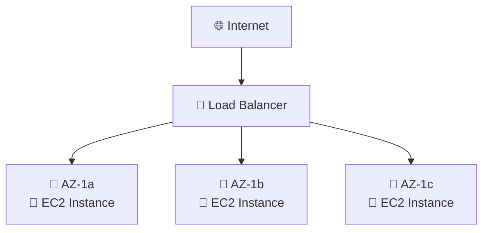

# 📚 AWS Certificación Arquitecto - ELB y Auto Scaling Groups

## 📋 Índice
- [🎯 Escalabilidad y Alta Disponibilidad](#escalabilidad-y-alta-disponibilidad)
- [⚖️ Elastic Load Balancer (ELB)](#elastic-load-balancer-elb)
  - [🌐 Application Load Balancer (ALB)](#application-load-balancer-alb)
  - [⚡ Network Load Balancer (NLB)](#network-load-balancer-nlb)
  - [🚪 Gateway Load Balancer (GWLB)](#gateway-load-balancer-gwlb)
  - [🍪 Sticky Sessions](#sticky-sessions)
  - [🌍 Cross-Zone Load Balancing](#cross-zone-load-balancing)
  - [🔒 SSL/TLS Certificates](#ssltls-certificates)
  - [🔄 Connection Draining](#connection-draining)
- [🔄 Auto Scaling Groups (ASG)](#auto-scaling-groups-asg)
  - [� Políticas de Escalado](#políticas-de-escalado)
  - [🎯 Escalado Predictivo](#escalado-predictivo)
- [�🛡️ Grupos de Seguridad](#grupos-de-seguridad)
- [🏗️ Caso de Uso: E-commerce Escalable](#caso-de-uso-e-commerce-escalable)
- [🎯 Conceptos Críticos para el Examen](#conceptos-críticos-para-el-examen)

---

## 🎯 Escalabilidad y Alta Disponibilidad

### 📖 Conceptos Fundamentales

**Escalabilidad** significa que una aplicación/sistema puede manejar mayores cargas adaptándose automáticamente.

> ⚠️ **Importante**: La escalabilidad está vinculada pero es diferente a la alta disponibilidad

### 📊 Tipos de Escalabilidad

#### 📈 Escalabilidad Vertical (Scale Up/Down)
```
🔧 Aumentar el tamaño de la instancia
├── CPU más potente
├── Más memoria RAM  
├── Mejor almacenamiento
└── Mayor ancho de banda de red
```

**Características:**
- ✅ De `t2.micro` escalar hasta `t2.large`
- ✅ Común en bases de datos
- ✅ Sistemas no distribuidos
- ❌ Limitado por el hardware máximo disponible

**Ejemplo en EC2:**
```
Desde: t2.nano     → 0.5GB RAM, 1 vCPU
Hasta: u-12tb1.metal → 12TB RAM, 448 vCPUs
```

#### 📊 Escalabilidad Horizontal (Scale Out/In) = Elasticidad
```
🔄 Aumentar el número de instancias
├── Más servidores trabajando en paralelo
├── Sistemas distribuidos
├── Tolerancia a fallos mejorada
└── Sin límites teóricos de capacidad
```

**Características:**
- ✅ Común en aplicaciones web modernas
- ✅ Fácil de escalar en el cloud (Amazon EC2)
- ✅ Mayor resistencia a fallos
- ✅ Costos más predecibles

### 🏢 Alta Disponibilidad (High Availability)



**Definición:**
- 🎯 Ejecutar la aplicación en al menos 2 Availability Zones (AZ)
- 🛡️ Objetivo: sobrevivir a desastres del centro de datos
- 🤝 Suele ir de la mano con el escalado horizontal

### 🎛️ Escalabilidad y Alta Disponibilidad en EC2

| Tipo | Método | Herramientas AWS |
|------|--------|------------------|
| 📈 **Vertical** | Aumentar tamaño de instancia | ⬆️ Scale Up/Down manual |
| 📊 **Horizontal** | Aumentar número de instancias | 🔄 Auto Scaling Group<br/>⚖️ Load Balancer |
| 🏢 **Alta Disponibilidad** | Multi-AZ deployment | 🌐 ASG Multi-AZ<br/>🔗 ELB Multi-AZ |

---

## ⚖️ Elastic Load Balancer (ELB)

### 🤔 ¿Qué es un Load Balancer?

Los **Load Balancers** son servidores que reenvían tráfico a varios servidores backend (por ejemplo, instancias EC2).

```
👥 Usuarios                    ⚖️ Elastic Load Balancer                 📱 Instancias EC2
                                        (ELB)
👤 Usuario 1 ──┐                                                      ┌── 🖥️ EC2 Instancia 1
👤 Usuario 2 ──┼────────────► 🔄 Distribución Inteligente ────────────┼── 🖥️ EC2 Instancia 2  
👤 Usuario 3 ──┘              del Tráfico                             └── 🖥️ EC2 Instancia 3
```

### 🎯 ¿Por qué utilizar Load Balancers?

| Beneficio | Descripción | Icono |
|-----------|-------------|-------|
| **Distribución de Carga** | Repartir tráfico entre varias instancias | ⚖️ |
| **Punto único de acceso** | Exponer un único punto DNS para tu app | 🌐 |
| **Tolerancia a fallos** | Manejar fallos de instancias automáticamente | 🛡️ |
| **Health Checks** | Monitoreo continuo de la salud de instancias | ❤️ |
| **Terminación SSL** | Proporcionar HTTPS para sitios web | 🔒 |
| **Session Stickiness** | Adherencia con cookies de sesión | 🍪 |
| **Alta Disponibilidad** | Distribución entre múltiples AZs | 🏢 |
| **Seguridad** | Separar tráfico público del privado | 🔐 |

### 🚀 ¿Por qué Elastic Load Balancer?

#### ✅ Ventajas del ELB Gestionado:
- 🔧 **Gestionado por AWS**: No necesitas mantener la infraestructura
- 🔄 **Actualizaciones automáticas**: AWS se encarga del mantenimiento
- 📈 **Escalabilidad automática**: Se adapta a la demanda
- 💰 **Costo-efectivo**: Más barato que gestionar tu propio balanceador
- 🛡️ **Alta disponibilidad**: Garantizada por AWS

### ❤️ Health Checks (Controles de Salud)

Los health checks son **cruciales** para el funcionamiento del Load Balancer.

```
                    ❤️ Health Check
                    HTTP GET /health
                    Puerto: 80
                    Intervalo: 30s
                           │
                           ▼
⚖️ Elastic Load Balancer ──────────► 📱 EC2 Instancia 1 (✅ Healthy)
        (ELB)              │
                           ├────────► 📱 EC2 Instancia 2 (✅ Healthy)
                           │
                           └────────► 📱 EC2 Instancia 3 (❌ Unhealthy)
                                      (No recibe tráfico)
```

#### 🔍 Funcionamiento:
- ✅ **Endpoint**: Se realiza en un puerto y ruta (`/health` es común)
- ⏱️ **Periodicidad**: Cada 30 segundos por defecto
- ❌ **Fallo**: Si falla, la instancia se marca como "unhealthy"
- 🚫 **Redirección**: El tráfico no se envía a instancias unhealthy
- 🔄 **Recuperación**: Automática cuando la instancia vuelve a estar healthy

### 🎛️ Tipos de Load Balancers

| Tipo | Año | Protocolo | Capa OSI | Uso Recomendado |
|------|-----|-----------|----------|-----------------|
| **🏛️ Classic Load Balancer (CLB)** | 2009 | HTTP, HTTPS, TCP, SSL | 4 y 7 | ❌ Legacy (no recomendado) |
| **🌐 Application Load Balancer (ALB)** | 2016 | HTTP, HTTPS, WebSocket | 7 | ✅ Aplicaciones web modernas |
| **⚡ Network Load Balancer (NLB)** | 2017 | TCP, UDP, TLS | 4 | ✅ Alto rendimiento, baja latencia |
| **🚪 Gateway Load Balancer (GWLB)** | 2020 | IP Protocol | 3 | ✅ Appliances de red, firewalls |

---

## 🌐 Application Load Balancer (ALB)

### 📋 Características del ALB (Capa 7 - HTTP)

El **Application Load Balancer** opera en la capa 7 del modelo OSI, permitiendo funcionalidades avanzadas de enrutamiento HTTP/HTTPS.

```
🌐 Internet Requests
         │
         ▼
    ⚖️ ALB (Layer 7)
    ┌─────────────────┐
    │  📍 Rules Engine │
    │  🔀 Path Routing │ 
    │  🏷️  Host Headers │
    │  📊 Query Params │
    └─────────────────┘
         │
    ┌────┴────────────┐
    ▼                 ▼
🎯 Target Group 1   🎯 Target Group 2
/api/users          /api/orders
📱 EC2 Instances    📱 EC2 Instances
🐳 ECS Tasks       🐳 ECS Tasks
```

### 🎯 Funcionalidades Avanzadas:

#### 🔀 Enrutamiento Basado en Reglas:
| Tipo de Enrutamiento | Ejemplo | Uso |
|---------------------|---------|-----|
| **🌍 Host-based** | `api.example.com` vs `web.example.com` | Microservicios por dominio |
| **📂 Path-based** | `/api/users` vs `/api/orders` | APIs RESTful |
| **❓ Query String** | `?version=v2&region=us-east` | A/B Testing |
| **🏷️ Header-based** | `X-User-Type: premium` | Usuarios premium |

#### 📦 Target Groups Soportados:
```yaml
🎯 Target Groups:
  📱 EC2 Instances:     # Instancias tradicionales
    - Auto Scaling Groups
    - Manual registration
  
  🐳 ECS Tasks:         # Contenedores
    - Dynamic port mapping
    - Service discovery
  
  ⚡ Lambda Functions:  # Serverless
    - Event-driven processing
    - Microservices
  
  🌐 IP Addresses:      # Hybrid
    - On-premises servers
    - Third-party services
```

### 🏗️ Ejemplo de Arquitectura ALB:

```
👥 Users                     🌐 ALB                    🎯 Target Groups
                        (one.example.com)
🌍 Web Traffic ────────────► 📂 /                  ────► 🖥️ Web Servers
                             📂 /api               ────► 🐳 API Containers  
🔧 API Traffic ────────────► 📂 /admin             ────► 🛡️ Admin Instances
                             
                        (two.example.com)
📱 Mobile Traffic ─────────► 📂 /mobile            ────► 📱 Mobile Backend
```

### ✅ Ventajas del ALB:
- 🔄 **Dynamic Port Mapping**: Ideal para contenedores (Docker/ECS)
- 🎯 **Advanced Routing**: Múltiples reglas de enrutamiento
- 🔍 **Content-based Routing**: Decisiones basadas en contenido HTTP
- 📊 **WebSocket Support**: Conexiones bidireccionales
- 🛡️ **WAF Integration**: Protección contra ataques web

### 📊 Client IP Preservation:
```
👤 Client                🌐 ALB                    📱 EC2 Instance
(203.0.113.12)           
                    ┌─────────────────┐
Real IP ──────────► │ X-Forwarded-For │ ──────────► Headers:
Port ──────────────► │ X-Forwarded-Port│             - X-Forwarded-For: 203.0.113.12
Proto ─────────────► │ X-Forwarded-Proto│            - X-Forwarded-Port: 443  
                    └─────────────────┘             - X-Forwarded-Proto: https
```

---

## ⚡ Network Load Balancer (NLB)

### 🚀 Características del NLB (Capa 4 - TCP/UDP)

El **Network Load Balancer** opera en la capa 4 del modelo OSI, optimizado para **ultra-alta performance** y **baja latencia**.

```
🌐 TCP/UDP Traffic
         │
         ▼
    ⚡ NLB (Layer 4)
    ┌─────────────────┐
    │  🚀 Ultra Fast   │
    │  ⚡ 100ms latency│ 
    │  📊 Millions RPS │
    │  🎯 Static IP    │
    └─────────────────┘
         │
    ┌────┴────────────┐
    ▼                 ▼
🎯 Target Group 1   🎯 Target Group 2
TCP:80              TCP:443
📱 EC2 Instances    🌐 ALB (cascading)
```

### 📊 Performance Metrics:

| Métrica | NLB | ALB | Diferencia |
|---------|-----|-----|------------|
| **⚡ Latencia** | ~100ms | ~400ms | 🚀 4x más rápido |
| **📊 Throughput** | Millones RPS | Miles RPS | 🎯 1000x más escalable |
| **💰 Costo** | $$$ | $$ | ❌ No incluido en free tier |
| **🔍 Inspección** | Capa 4 solo | Capa 7 completa | 🎯 Menos overhead |

### 🎯 Target Groups del NLB:

```yaml
🎯 NLB Target Groups:
  📱 EC2 Instances:
    - High-performance apps
    - Gaming servers
    - IoT backends
  
  🌐 Application Load Balancer:
    - Hybrid routing (L4 + L7)
    - Best of both worlds
  
  🌍 IP Addresses (Private):
    - On-premises integration
    - Hybrid cloud architectures
```

### 🛡️ Health Checks del NLB:
```
⚡ NLB Health Checks
├── 🔍 TCP Health Check (Layer 4)
├── 🌐 HTTP Health Check (Layer 7)  
└── 🔒 HTTPS Health Check (Layer 7)

Ejemplo configuración:
- Protocol: TCP
- Port: 80
- Interval: 30s
- Healthy threshold: 3
- Unhealthy threshold: 3
```

### 🏗️ Casos de Uso del NLB:
- 🎮 **Gaming Applications**: Baja latencia crítica
- 🏦 **Financial Trading**: Microsegundos importan
- 🔄 **Real-time Streaming**: Video/Audio en vivo
- 🌐 **IoT Applications**: Millones de dispositivos
- 🔧 **Legacy Applications**: Solo TCP/UDP

---

## 🚪 Gateway Load Balancer (GWLB)

### 🛡️ Características del GWLB (Capa 3 - IP)

El **Gateway Load Balancer** opera en la capa 3 (Network), diseñado para **appliances de red** y **dispositivos de seguridad**.

```
🌐 Internet Traffic
         │
         ▼
    🚪 GWLB (Layer 3)
    ┌─────────────────┐
    │  🛡️ Firewalls    │
    │  🔍 IDS/IPS      │ 
    │  📊 DPI Systems  │
    │  🌐 GENEVE:6081  │
    └─────────────────┘
         │
    🎯 Target Group
    ┌─────────────────┐
    │ 🛡️ Firewall VMs  │
    │ 🔍 Security Apps │
    │ 📊 Network Tools │
    └─────────────────┘
```

### 🔧 Protocolo GENEVE:
```
🌐 GENEVE Protocol (Puerto 6081)
├── 📦 Encapsulación de paquetes IP
├── 🔄 Transparent network gateway  
├── ⚖️ Load balancing de appliances
└── 🔍 Deep packet inspection
```

> 💡 **Tip del Examen**: Si ves mencionar el protocolo **GENEVE** o puerto **6081**, la respuesta es **Gateway Load Balancer**.

### 🎯 Target Groups del GWLB:
- 📱 **EC2 Instances**: Running security appliances
- 🌍 **IP Addresses**: Private IPs only

### 🏗️ Casos de Uso del GWLB:
- 🛡️ **Firewalls**: Palo Alto, Fortinet, Check Point
- 🔍 **IDS/IPS**: Intrusion Detection/Prevention
- 📊 **DPI**: Deep Packet Inspection
- 🔄 **Network Monitoring**: Traffic analysis tools

---

## 🍪 Sticky Sessions (Session Affinity)

### 🎯 ¿Qué son las Sticky Sessions?

Las **Sticky Sessions** aseguran que un cliente siempre sea dirigido a la **misma instancia** backend, manteniendo la persistencia de sesión.

```
👥 Users                    ⚖️ ALB/CLB                   📱 EC2 Instances
                           🍪 Session Cookies
👤 User 1 (Cookie: A) ────────────────────────────────► 🖥️ EC2-1 (Session A)
👤 User 2 (Cookie: B) ────────────────────────────────► 🖥️ EC2-2 (Session B)  
👤 User 3 (Cookie: A) ────────────────────────────────► 🖥️ EC2-1 (Session A)
```

### 🛠️ Tipos de Cookies:

#### 🏷️ Application-based Cookies:
```yaml
🍪 Custom Application Cookie:
  Generated by: Target application
  Cookie name: Custom (JSESSIONID, custom-session, etc.)
  Duration: Controlled by application
  Attributes: Can include app-specific data
  ⚠️ Reserved names: AWSALB, AWSALBAPP, AWSALBTG
```

#### ⚖️ Load Balancer Generated Cookies:

| Tipo | Cookie Name | Generado por | Duración |
|------|-------------|--------------|----------|
| **🎯 Application Cookie** | `AWSALBAPP` | ALB | Configurable |
| **⏰ Duration-based** | `AWSALB` (ALB)<br/>`AWSELB` (CLB) | Load Balancer | Fixed duration |

### ⚠️ Consideraciones Importantes:

#### ✅ Ventajas:
- 💾 **Persistencia de sesión**: Datos no se pierden
- 🎯 **User experience**: Consistencia de estado
- 🛡️ **Security**: Mantiene tokens de autenticación

#### ❌ Desventajas:
- ⚖️ **Load imbalance**: Distribución desigual
- 🔄 **Failover complexity**: Pérdida de sesión si instance falla
- 📊 **Scaling issues**: Hot spots en instancias

### 🏗️ Alternativas Modernas:
```
📊 Shared Session Storage
├── 🔄 ElastiCache (Redis/Memcached)
├── 🗄️ DynamoDB Session Store
├── 🌐 External session management
└── 🔄 Stateless applications (JWT tokens)
```

---

## 🌍 Cross-Zone Load Balancing

### 🎯 ¿Qué es Cross-Zone Load Balancing?

Distribuye el tráfico **uniformemente** entre todas las instancias registradas en **todas las AZs**, independientemente de la AZ del Load Balancer.

#### ✅ Con Cross-Zone Load Balancing:
```
🌐 Internet (100 requests)
         │
    ⚖️ ELB Nodes
    ┌─────┬─────┐
    │ AZ-A│ AZ-B│
    │ 50% │ 50% │
    └─────┴─────┘
         │
    ┌────┼────────┐
    ▼    ▼        ▼
   📱   📱       📱
  AZ-A AZ-A     AZ-B
 (16.7%)(16.7%) (16.7%)
   
   📱   📱       📱
  AZ-A AZ-A     AZ-B
 (16.7%)(16.7%) (16.7%)
```

#### ❌ Sin Cross-Zone Load Balancing:
```
🌐 Internet (100 requests)
         │
    ⚖️ ELB Nodes
    ┌─────┬─────┐
    │ AZ-A│ AZ-B│
    │ 50% │ 50% │
    └─────┴─────┘
         │
    ┌────┘     └────┐
    ▼              ▼
   📱   📱         📱
  AZ-A AZ-A       AZ-B
 (12.5%)(12.5%)  (50%)
   
   📱   📱    
  AZ-A AZ-A    
 (12.5%)(12.5%)
```

### 🔧 Configuración por Tipo de ELB:

| Load Balancer Type | Cross-Zone Default | Data Transfer Cost | Control |
|-------------------|-------------------|-------------------|---------|
| **🌐 ALB** | ✅ Always ON | 🆓 No charge | ❌ No control |
| **⚡ NLB** | ❌ Disabled | 💰 $0.01/GB | ✅ Can enable |
| **🚪 GWLB** | ❌ Disabled | 💰 $0.01/GB | ✅ Can enable |
| **🏛️ CLB** | ❌ Disabled | 🆓 No charge | ✅ Can enable |

### 💡 Best Practices:
- 🌐 **ALB**: Ya está optimizado, no te preocupes
- ⚡ **NLB**: Habilita solo si necesitas distribución uniforme
- 💰 **Cost**: Considera costos de transferencia entre AZs
- 🎯 **Performance**: Puede aumentar latencia ligeramente

---

## 🔒 SSL/TLS Certificates

### 🔐 Conceptos Fundamentales

**SSL/TLS** permite cifrado de tráfico **en tránsito** entre clientes y el Load Balancer.

```
👤 Client                🔒 SSL/TLS                ⚖️ Load Balancer
                       (Encrypted Tunnel)
🌐 HTTPS Request ──────► 🛡️ Certificate ──────────► 📊 HTTP to Backend
                         Validation                 (Internal network)
```

### 📜 Gestión de Certificados:

#### 🏆 AWS Certificate Manager (ACM):
```yaml
🔒 ACM Benefits:
  ✅ Free SSL certificates
  🔄 Auto-renewal
  🌐 Wildcard support (*.example.com)
  🔧 Easy integration with ELB
  📊 CloudWatch monitoring
  🛡️ Security best practices
```

#### 📤 Custom Certificates:
```yaml
📋 Custom Certificate Options:
  🏢 Enterprise CA certificates
  🌍 Third-party providers (GoDaddy, Comodo)
  🔧 Self-signed (dev/test only)
  📱 Import via ACM or IAM
```

### 🌐 Server Name Indication (SNI)

**SNI** permite múltiples certificados SSL en un solo Load Balancer:

```
👥 Multiple Domains          ⚖️ Load Balancer (SNI)          🎯 Target Groups
                            🔒 Multiple Certificates
api.example.com ──────────► 📜 api.example.com cert ──────► 🐳 API Services
web.example.com ──────────► 📜 web.example.com cert ──────► 🌐 Web Servers  
admin.example.com ────────► 📜 admin.example.com cert ────► 🛡️ Admin Panel
```

### 🛠️ Compatibilidad SNI:

| Load Balancer Type | SNI Support | Multiple Certificates |
|-------------------|-------------|----------------------|
| **🌐 ALB** | ✅ Full support | ✅ Multiple listeners |
| **⚡ NLB** | ✅ Full support | ✅ Multiple listeners |
| **🏛️ CLB** | ❌ No support | ❌ One certificate only |

### 🔧 Configuración de Políticas de Seguridad:

```yaml
🛡️ Security Policies:
  Modern (Recommended):
    - TLS 1.2, 1.3 only
    - Strong cipher suites
    - Perfect Forward Secrecy
  
  Intermediate:
    - TLS 1.0, 1.1, 1.2, 1.3
    - Balanced compatibility
  
  Legacy:
    - All TLS versions
    - Older cipher suites
    - Maximum compatibility
```

---

## 🔄 Connection Draining

### 🎯 ¿Qué es Connection Draining?

**Connection Draining** permite completar las requests en curso antes de desregistrar una instancia del Load Balancer.

```
⚖️ Load Balancer                    📱 EC2 Instance (Draining)
                                   🔄 Completing existing requests
🚫 No new requests ─────────────────► ❌ No new connections
                                   ⏱️ Timeout: 1-3600 seconds
⏳ Wait for completion ─────────────► ✅ Finish active sessions
✅ Instance removed ────────────────► 🗑️ Graceful shutdown
```

### 🏷️ Terminología por Tipo de ELB:

| Load Balancer Type | Feature Name | Description |
|-------------------|--------------|-------------|
| **🏛️ CLB** | Connection Draining | Legacy term |
| **🌐 ALB/⚡ NLB** | Deregistration Delay | Modern term |

### ⚙️ Configuración:

```yaml
🔧 Connection Draining Settings:
  ⏱️ Duration: 1-3600 seconds (default: 300s)
  🎯 Behavior: 
    - Stop sending new requests
    - Allow existing requests to complete
    - Monitor active connections
  ⚡ Disable: Set to 0 seconds
```

### 🎯 Casos de Uso:

#### ✅ Cuándo usar Connection Draining:
- 🔄 **Auto Scaling**: Scale-in events
- 🛠️ **Maintenance**: Planned instance replacement
- 🚀 **Deployment**: Blue/green deployments
- 🔧 **Updates**: Application updates

#### ⚡ Recomendaciones de Timeout:
```yaml
📊 Timeout Recommendations:
  🌐 Web Applications: 60-300 seconds
  🔄 API Services: 30-120 seconds  
  📱 Mobile Backends: 120-300 seconds
  🎮 Gaming/Realtime: 10-60 seconds
  📊 Analytics: 300-600 seconds
```

### � Monitoreo:
```
📈 CloudWatch Metrics:
├── 🔄 TargetDeregistrationDelay
├── 📊 ActiveConnectionCount  
├── ⏱️ TargetResponseTime
└── 🎯 HealthyHostCount
```

---

## 🔄 Auto Scaling Groups (ASG)

### 🎯 ¿Qué es Auto Scaling Groups?

**ASG** automatiza la gestión de instancias EC2 basándose en demanda, manteniendo disponibilidad y optimizando costos.

```
📊 Traffic Patterns              🔄 ASG Response               📱 EC2 Fleet
                                
🌅 Low Traffic    ────────────► 📉 Scale In  ─────────────► 📱📱 (2 instances)
🌞 Normal Traffic ────────────► ⚖️ Maintain ─────────────► 📱📱📱 (3 instances)  
🔥 High Traffic   ────────────► 📈 Scale Out ────────────► 📱📱📱📱📱 (5 instances)
🌙 Night Time     ────────────► 📉 Scale In  ─────────────► 📱 (1 instance)
```

### 🎯 Objetivos del ASG:

| Objetivo | Descripción | Beneficio |
|----------|-------------|-----------|
| **📈 Scale Out** | Añadir instancias EC2 | Manejar picos de demanda |
| **📉 Scale In** | Eliminar instancias EC2 | Reducir costos |
| **🛡️ Min/Max** | Mantener límites definidos | Control de capacidad |
| **🔄 Replace** | Reemplazar instancias unhealthy | Alta disponibilidad |
| **💰 Free** | ASG es gratuito | Solo pagas por EC2 |

### 🚀 Integración con Load Balancer:

```
🌐 Internet
     │
     ▼
⚖️ Application Load Balancer
     │
     ▼
🎯 Target Group (Dynamic)
     │
┌────┼────────────┐
▼    ▼            ▼
📱  📱           📱
EC2 EC2          EC2
(Auto-registered by ASG)

🔄 ASG Controller
├── 📊 Monitors metrics
├── 🔧 Launches instances  
├── 🎯 Registers to target group
└── 🗑️ Terminates unhealthy instances
```

### 🛠️ Componentes del ASG:

#### 🚀 Launch Template (Recomendado):
```yaml
🚀 Launch Template Configuration:
  📷 AMI ID: ami-12345678
  🖥️ Instance Type: t3.medium
  🔑 Key Pair: my-key-pair
  🛡️ Security Groups: [sg-web, sg-app]
  🔧 User Data: |
    #!/bin/bash
    yum update -y
    systemctl start httpd
  💾 EBS Volumes:
    - Root: 20GB gp3
    - Data: 100GB gp3
  🏷️ Instance Profile: EC2-Web-Role
  🌐 Subnet: [subnet-1a, subnet-1b, subnet-1c]
```

#### 🏛️ Launch Configuration (Legacy):
```yaml
⚠️ Launch Configuration (Deprecated):
  - Cannot be modified after creation
  - Limited instance type options
  - No support for latest features
  - Use Launch Templates instead
```

### 📊 Configuración de Capacidad:

```yaml
🎛️ ASG Capacity Settings:
  📉 Minimum Size: 1        # Always maintain
  🎯 Desired Capacity: 3    # Target number
  📈 Maximum Size: 10       # Never exceed
  
🌍 Multi-AZ Distribution:
  📍 AZ-1a: 1 instance
  📍 AZ-1b: 1 instance  
  📍 AZ-1c: 1 instance
```

### 🔄 Health Checks:

| Type | Description | Use Case |
|------|-------------|----------|
| **📱 EC2** | Instance status checks | System/hardware issues |
| **⚖️ ELB** | Load balancer health checks | Application-level health |
| **🎯 Custom** | CloudWatch alarms | Business logic health |

```
🔍 Health Check Flow:
├── ⚡ Instance Status: Running/Stopped
├── 🌐 System Reachability: Network connectivity
├── ⚖️ ELB Health: HTTP response codes
└── 🔄 Replace unhealthy instances automatically
```

---

## 📊 Políticas de Escalado

### 🎯 Target Tracking Scaling (Recomendado)

La política más **simple y efectiva** para la mayoría de casos de uso:

```
📊 Target Tracking Example
                    🎯 Target: 50% CPU
                         │
    ┌──────────────────────┼──────────────────────┐
    ▼                      ▼                      ▼
📈 Scale Out          ⚖️ Maintain            📉 Scale In
CPU > 50%            CPU ≈ 50%              CPU < 50%
Add instances        Do nothing             Remove instances
```

#### 🔧 Métricas Disponibles:
```yaml
🎯 Target Tracking Metrics:
  📊 CPU Utilization: 40-80% (recommended)
  🌐 Request Count per Target: Based on capacity
  📈 Network In/Out: Bandwidth-intensive apps
  🏷️ Custom CloudWatch Metrics: Business-specific
```

### 📈 Step Scaling

Escalado basado en **múltiples umbrales** con **acciones específicas**:

```
📊 Step Scaling Configuration
        🚨 CloudWatch Alarm Triggers
                    │
        ┌───────────┼───────────┐
        ▼           ▼           ▼
    📉 Scale In  ⚖️ Normal   📈 Scale Out
    CPU < 30%   30-70% CPU   CPU > 70%
        │           │           │
        ▼           ▼           ▼
   Remove 1    Do Nothing    Add 2 instances
   instance                  
                             🔥 CPU > 90%
                                 │
                                 ▼
                            Add 4 instances
```

#### ⚙️ Configuración de Pasos:
```yaml
📈 Step Scaling Example:
  Scale Out Steps:
    - CPU 70-80%: +1 instance
    - CPU 80-90%: +2 instances  
    - CPU >90%:   +4 instances
  
  Scale In Steps:
    - CPU 30-40%: -1 instance
    - CPU <30%:   -2 instances
```

### 📅 Scheduled Scaling

Escalado **predecible** basado en **patrones conocidos**:

```
📅 Scheduled Scaling Example - E-commerce
                    
🌅 06:00  Min=2, Desired=3, Max=5   # Morning prep
🌞 09:00  Min=3, Desired=5, Max=10  # Business hours
🍽️ 12:00  Min=5, Desired=8, Max=15  # Lunch peak
🌆 18:00  Min=3, Desired=5, Max=10  # Evening traffic
🌙 22:00  Min=1, Desired=2, Max=5   # Night time
🔁 Repeat daily
```

#### 📊 Casos de Uso:
- 🛒 **E-commerce**: Black Friday, holiday sales
- 🎓 **Education**: Enrollment periods, exam times
- 📺 **Media**: Live events, content releases
- 💼 **B2B**: Business hours vs weekends

### ⚡ Simple Scaling (Legacy)

**No recomendado** - mantiene cooldown periods que limitan responsiveness:

```yaml
⚠️ Simple Scaling (Avoid):
  Trigger: CPU > 70%
  Action: Add 1 instance
  Cooldown: 5 minutes    # Cannot scale during cooldown
  Problem: Slow response to rapid changes
```

### 🔧 Best Practices para Políticas:

| Aspect | Recommendation | Reason |
|--------|---------------|---------|
| **🎯 Primary** | Target Tracking | Simplest, most effective |
| **📊 Metric** | CPU 40-60% | Good balance |
| **⏱️ Warmup** | 300 seconds | Allow instance startup |
| **🔄 Multiple** | Combine policies | Different scenarios |
| **📈 Scaling** | Conservative | Avoid thrashing |

---

## 🎯 Escalado Predictivo

### 🔮 ¿Qué es Predictive Scaling?

**Machine Learning** que analiza patrones históricos para **predecir** y **pre-escalar** antes de que llegue la demanda.

```
📊 Historical Analysis      🔮 ML Prediction        📈 Proactive Scaling
                           
📅 Last 14 days    ────────► 🧠 ML Model ──────────► 🚀 Scale before demand
🕐 Hourly patterns         🔍 Pattern detection     ⏰ Pre-warming instances
📈 Weekly trends          📊 Demand forecasting    💰 Cost optimization
🎯 Traffic spikes         🎯 Capacity planning     🛡️ Availability assurance
```

### 🛠️ Configuración:

```yaml
🔮 Predictive Scaling Setup:
  📊 Metric: CPU Utilization
  🎯 Target: 50%
  📅 Schedule: Every hour
  🕐 Load forecast: 24 hours ahead
  ⚡ Scale out: 5 minutes before predicted load
  🔄 Mode:
    - ForecastAndScale: Automatic scaling
    - ForecastOnly: Generate forecasts only
```

### 📈 Métricas Recomendadas:

| Métrica | Descripción | Cuándo Usar |
|---------|-------------|-------------|
| **🖥️ CPU Utilization** | Promedio de CPU | Aplicaciones CPU-intensive |
| **📊 Request Count** | Requests per target | Web applications |
| **📈 Network In** | Incoming network traffic | Bandwidth-sensitive apps |
| **📉 Network Out** | Outgoing network traffic | Content delivery |
| **🏷️ Custom Metrics** | Business-specific | E-commerce transactions |

### 💡 Best Practices:

#### ✅ Cuándo Usar:
- 📊 **Patterns predecibles**: Daily/weekly cycles
- 🎯 **Lead time needed**: Instance launch > 2 minutes
- 💰 **Cost optimization**: Reduce reactive scaling
- 🛡️ **Critical availability**: Cannot afford downtime

#### ❌ Cuándo No Usar:
- 🔄 **Random traffic**: No predictable patterns
- ⚡ **Instant scaling**: Lambda or containers better
- 💰 **Cost-sensitive**: Predictive scaling costs more
- 🔧 **Simple workloads**: Target tracking sufficient

### 🕐 Cool-down Periods:

```yaml
🔧 Cool-down Configuration:
  📈 Scale Out Cooldown: 300 seconds
    - Prevent rapid successive scaling
    - Allow new instances to start contributing
  
  📉 Scale In Cooldown: 300 seconds  
    - Avoid premature termination
    - Ensure traffic has shifted
  
  ⚡ Instance Warmup: 300 seconds
    - Time for application startup
    - Before considering for scaling decisions
```

### 📊 Monitoreo y Ajuste:

```
📈 CloudWatch Metrics to Monitor:
├── 🎯 GroupDesiredCapacity
├── 📊 GroupInServiceInstances
├── 🔄 GroupPendingInstances  
├── 📉 GroupTerminatingInstances
├── ⏱️ GroupStandbyInstances
└── 🚨 ScalingActivities
```

### 💡 Optimización de AMI:

```yaml
🚀 AMI Optimization for Fast Scaling:
  ✅ Pre-installed software:
    - Application runtime
    - Dependencies
    - Configuration files
  
  ✅ Fast boot optimizations:
    - Minimal services
    - Optimized startup scripts
    - Pre-warmed caches
  
  🎯 Target: <60 seconds from launch to ready
```

---

## 🛡️ Grupos de Seguridad

Los grupos de seguridad controlan el tráfico entre usuarios, balanceadores de carga y las instancias EC2.

```
👥 Usuarios                 🛡️ Security Group 1           🛡️ Security Group 2
                           (Permite HTTP/HTTPS)           (Solo tráfico desde ELB)
                           ┌─────────────────────┐        ┌─────────────────────┐
                           │                     │        │                     │
🌐 Internet ──HTTP/HTTPS──►│  ⚖️ Load Balancer   │──HTTP──►│  📱 EC2 Instancias │
                           │      (ELB)          │Restrict│                     │
                           │                     │        │                     │
                           └─────────────────────┘        └─────────────────────┘
```

### 🎯 Beneficios de esta arquitectura:

| Beneficio | Descripción | Icono |
|-----------|-------------|-------|
| **Aislamiento** | Las EC2 no reciben tráfico directo de internet | 🔒 |
| **Filtrado** | ELB reenvía solo el tráfico necesario | 🔍 |
| **Puertos específicos** | Solo se exponen puertos necesarios (80, 443) | 🚪 |
| **Origen controlado** | EC2 solo acepta tráfico del balanceador | 🎯 |
| **Seguridad en capas** | Múltiples niveles de protección | 🛡️ |
| **Reglas granulares** | Control específico por cada capa | ⚙️ |

### 📝 Configuración típica:

#### 🌐 Security Group del ELB:
```yaml
Inbound Rules:
  - HTTP (80): 0.0.0.0/0    # Todo internet
  - HTTPS (443): 0.0.0.0/0  # Todo internet

Outbound Rules:
  - HTTP (80): SG-EC2       # Solo hacia instancias EC2
  - Custom: Health Check ports
```

#### 📱 Security Group de EC2:
```yaml
Inbound Rules:
  - HTTP (80): sg-elb-xxx   # Solo desde el ELB
  - SSH (22): MY-IP/32      # Solo mi IP para administración

Outbound Rules:
  - All traffic: 0.0.0.0/0  # Internet para actualizaciones
```

---

## 🎯 Conceptos Críticos para el Examen

### 🚨 CONCEPTS THAT TRIP STUDENTS UP - MEMORIZAR

#### 🔥 1. ALB Target Groups - Enrutamiento Avanzado

```
❓ PREGUNTA TÍPICA DEL EXAMEN:
"Los Load Balancers de aplicaciones pueden enrutar el tráfico a diferentes 
Grupos de Destino en función de..."

✅ RESPUESTAS CORRECTAS:
├── 🌍 Host headers (api.example.com vs web.example.com)
├── 📂 Path patterns (/api/users vs /api/orders) 
├── ❓ Query strings (?version=v2&region=us-east)
├── 🏷️ HTTP headers (X-User-Type: premium)
└── 🔍 Source IP (Geographic routing)

❌ RESPUESTAS INCORRECTAS:
├── 📱 Instance type (EC2 size)
├── 🌐 AZ location only
└── 💾 Storage type
```

**💡 EXAM TIP**: Si ves una pregunta sobre "content-based routing" o "Layer 7 routing", siempre piensa en ALB.

#### 🔥 2. Target Groups - ¿Qué pueden ser targets?

```
🎯 ALB Target Groups - MEMORIZAR:
✅ EC2 Instances          # Traditional servers
✅ ECS Tasks             # Containers with dynamic ports  
✅ Lambda Functions      # Serverless integration
✅ IP Addresses          # On-premises or third-party
❌ RDS Databases         # NEVER - databases aren't web targets
❌ S3 Buckets           # NEVER - static content via CloudFront
❌ Auto Scaling Groups   # ASG registers instances, not itself
```

**⚠️ CRITICAL**: Los destinos registrados en un Grupo de Destino para un Load Balancer de Aplicaciones pueden ser **instancias EC2, tareas ECS, funciones Lambda, o direcciones IP privadas**. NUNCA databases o storage services.

#### 🔥 3. Sticky Sessions - Cookies Específicas

```
🍪 COOKIE NAMES - EXAMEN GUARANTEED:

ALB Generated Cookies:
├── 🎯 AWSALBAPP     # Application-controlled cookie
└── ⏰ AWSALB        # Duration-based cookie

CLB Generated Cookies:
└── 🏛️ AWSELB        # Classic Load Balancer cookie

Custom Application Cookies:
├── ✅ JSESSIONID    # Java applications  
├── ✅ PHPSESSID     # PHP applications
├── ✅ custom-session # Your own cookie name
└── ❌ AWSALBTG      # RESERVED - cannot use!

⚠️ RESERVED NAMES (DO NOT USE):
   AWSALB, AWSALBAPP, AWSALBTG
```

**🎯 EXAM SCENARIO**: "Quieres crear una cookie personalizada basada en la aplicación en tu Load Balancer de aplicaciones..."
- ✅ **Correcto**: Usar cualquier nombre EXCEPTO los reservados
- ❌ **Incorrecto**: Usar AWSALB, AWSALBAPP, AWSALBTG

#### 🔥 4. Auto Scaling - Políticas de Escalado

```
📊 SCALING POLICIES - EXAM CRITICAL:

🎯 Target Tracking (RECOMENDADO):
├── 📈 CPU Utilization (40-80%)
├── 🌐 Request Count per Target  
├── 📊 Network In/Out
└── 🏷️ Custom CloudWatch metrics

📈 Step Scaling (ADVANCED):
├── Multiple thresholds with specific actions
├── Example: CPU >70% → +1, CPU >90% → +3
└── More granular than Simple Scaling

📅 Scheduled Scaling (PREDICTABLE):
├── Based on known patterns
├── Example: Scale up at 9 AM, down at 6 PM
└── Great for business hours patterns

⚡ Simple Scaling (LEGACY - AVOID):
├── Single threshold, single action
├── Has cooldown periods that limit responsiveness  
└── Use Target Tracking instead
```

**🚨 EXAM ALERT**: Simple Scaling is **legacy** and has limitations. Target Tracking is always the preferred approach for dynamic scaling.

#### 🔥 5. Auto Scaling - Número de Peticiones por Minuto

```
📊 REQUEST COUNT SCALING - SPECIFIC SCENARIO:

❓ EXAM QUESTION: "Tu jefe te ha pedido que escales tu Auto Scaling Groups 
en función del número de peticiones por minuto..."

🎯 CORRECT APPROACH:
├── 1️⃣ Use Target Tracking Scaling Policy
├── 2️⃣ Metric: "Request Count per Target"  
├── 3️⃣ Set target value (e.g., 1000 requests per target)
├── 4️⃣ ASG will automatically scale to maintain this ratio
└── 5️⃣ Integrates with ALB metrics automatically

❌ WRONG APPROACHES:
├── Step Scaling with complex rules
├── Custom CloudWatch alarm with manual calculation
└── Simple Scaling (too basic)
```

**💡 KEY POINT**: ALB automatically provides "Request Count per Target" metric to CloudWatch. You don't need to calculate it manually.

#### 🔥 6. Application Deployment with ALB + ASG

```
🚀 DEPLOYMENT SCENARIO - EXAM FAVORITE:

❓ SCENARIO: "Una aplicación se despliega con un Application Load Balancer 
y un Auto Scaling Groups. Actualmente tiene 3 grupos de destino..."

🏗️ TYPICAL ARCHITECTURE:
Internet → ALB → 3 Target Groups → ASG Instances

🎯 Target Group Distribution:
├── 📂 /api/*     → API Target Group    → API ASG (2-10 instances)
├── 📂 /web/*     → Web Target Group    → Web ASG (3-15 instances)  
└── 📂 /admin/*   → Admin Target Group  → Admin ASG (1-3 instances)

🔍 KEY EXAM POINTS:
✅ Each Target Group can have different ASGs
✅ Different scaling policies per workload type
✅ Health checks specific to each target group
✅ Independent scaling based on workload patterns
```

#### 🔥 7. ASG with Load Balancer - Health Checks

```
❤️ HEALTH CHECK INTEGRATION:

🔄 ASG Health Check Types:
├── 📱 EC2 Health Check    # System-level (default)
├── ⚖️ ELB Health Check    # Application-level  
└── 🎯 Custom Health Check # CloudWatch alarms

⚠️ CRITICAL DISTINCTION:
├── EC2 Health: Instance running? Network reachable?
└── ELB Health: Application responding? HTTP 200 OK?

🎯 BEST PRACTICE:
Enable BOTH EC2 and ELB health checks for comprehensive monitoring.

❓ EXAM SCENARIO: "Your application is running but not responding to HTTP requests..."
✅ ELB Health Check would catch this
❌ EC2 Health Check alone would miss this
```

#### 🔥 8. Cross-Zone Load Balancing - Cost Implications

```
🌍 CROSS-ZONE LOAD BALANCING - EXAM CRITICAL:

💰 COST BREAKDOWN:
┌─────────────────┬──────────────┬───────────────────┬──────────────┐
│ Load Balancer   │ Default      │ Data Transfer     │ Control      │
│ Type            │ Status       │ Cost              │ Available    │
├─────────────────┼──────────────┼───────────────────┼──────────────┤
│ 🌐 ALB          │ ✅ Always ON │ 🆓 FREE           │ ❌ No control │
│ ⚡ NLB          │ ❌ Disabled  │ 💰 $0.01/GB       │ ✅ Can enable │
│ 🚪 GWLB         │ ❌ Disabled  │ 💰 $0.01/GB       │ ✅ Can enable │
│ 🏛️ CLB          │ ❌ Disabled  │ 🆓 FREE           │ ✅ Can enable │
└─────────────────┴──────────────┴───────────────────┴──────────────┘

❓ EXAM QUESTION: "You want to enable cross-zone load balancing on your NLB..."
⚠️ WARNING: This will incur data transfer charges between AZs!
```

#### 🔥 9. Connection Draining vs Deregistration Delay

```
🔄 TERMINOLOGY - EXAM CONFUSION POINT:

🏛️ Classic Load Balancer (CLB):
└── 🔄 "Connection Draining"

🌐 ALB / ⚡ NLB:  
└── 🔄 "Deregistration Delay"

⚡ SAME FUNCTIONALITY, DIFFERENT NAMES!

⚙️ Configuration:
├── 📊 Duration: 1-3600 seconds (default: 300s)
├── 🎯 Purpose: Complete in-flight requests gracefully
├── 🚫 Behavior: Stop new requests, finish existing ones
└── ⚡ Disable: Set to 0 seconds (immediate termination)

❓ EXAM QUESTION: "You want to ensure existing connections complete before terminating an instance..."
✅ Enable Connection Draining (CLB) or Deregistration Delay (ALB/NLB)
```

#### 🔥 10. Launch Templates vs Launch Configurations

```
🚀 LAUNCH COMPARISON - EXAM CRITICAL:

🆕 Launch Templates (RECOMMENDED):
├── ✅ Can be modified after creation
├── ✅ Version control and inheritance  
├── ✅ Mixed instance types support
├── ✅ Spot + On-Demand instances
├── ✅ Latest features support
├── ✅ Multiple instance types
└── ✅ Enhanced networking options

🏛️ Launch Configurations (LEGACY):
├── ❌ Cannot modify after creation
├── ❌ Single instance type only
├── ❌ Limited feature support  
├── ❌ No version control
└── ❌ Being deprecated

⚠️ EXAM RULE: Always choose Launch Templates over Launch Configurations unless specifically asked about legacy features.
```

### 🎯 Escenarios Típicos del Examen

#### 🔥 Scenario 1: Multi-Tier Web Application

```
❓ EXAM SCENARIO:
"You have a three-tier web application with web servers, application servers, 
and database servers. You want to ensure high availability and scalability..."

🏗️ CORRECT ARCHITECTURE:
Internet → ALB → Target Groups → ASGs

🎯 Implementation:
├── 🌐 ALB with path-based routing:
│   ├── /static/* → Web Tier Target Group
│   ├── /api/*    → API Tier Target Group  
│   └── /admin/*  → Admin Tier Target Group
├── 🔄 Separate ASGs per tier:
│   ├── Web ASG: 2-20 instances (public subnets)
│   ├── API ASG: 1-10 instances (private subnets)
│   └── Admin ASG: 1-3 instances (private subnets)
└── 🛡️ Security Groups with least privilege
```

#### 🔥 Scenario 2: Session Management

```
❓ EXAM SCENARIO:
"Your web application stores user session data locally on each server. 
Users are complaining about losing their sessions..."

❌ BAD SOLUTION: Enable sticky sessions
   Problems: Load imbalance, single point of failure

✅ BETTER SOLUTION: External session storage
├── 🔄 ElastiCache (Redis/Memcached)
├── 🗄️ DynamoDB for session data
├── 🔄 Stateless application design
└── 🎯 JWT tokens for authentication
```

#### 🔥 Scenario 3: SSL/TLS Certificate Management

```
❓ EXAM SCENARIO:
"You need to support multiple domains (api.example.com, web.example.com, 
admin.example.com) with SSL certificates on your load balancer..."

🔒 SOLUTION - SNI (Server Name Indication):
├── 🌐 ALB or ⚡ NLB (SNI supported)
├── 📜 Multiple ACM certificates  
├── 🎯 Multiple listeners with different certs
└── 🔍 Client specifies domain in TLS handshake

❌ CLB: Only supports ONE certificate
✅ ALB/NLB: Support MULTIPLE certificates via SNI
```

#### 🔥 Scenario 4: Performance Requirements

```
❓ EXAM SCENARIO:
"Your application requires ultra-low latency (<100ms) and can handle 
millions of requests per second..."

🚀 SOLUTION - Network Load Balancer:
├── ⚡ Layer 4 (TCP/UDP) operation
├── 📊 Millions of RPS capability
├── ⚡ ~100ms latency (vs ALB ~400ms)  
├── 🎯 Static IP addresses
├── 💰 Higher cost but better performance
└── 🔄 Can forward to ALB for Layer 7 features
```

#### 🔥 Scenario 5: Cost Optimization

```
❓ EXAM SCENARIO:
"You want to minimize costs while maintaining high availability 
for your Auto Scaling Groups..."

💰 COST OPTIMIZATION STRATEGY:
├── 🎯 Reserved Instances for baseline capacity
├── ⚡ Spot Instances for variable workload (50-90% savings)
├── 📊 Mixed Instance Types policy  
├── 📅 Scheduled scaling for predictable patterns
├── 🔄 Target Tracking for efficient scaling
└── 🌍 Cross-zone load balancing (consider data transfer costs)

🛠️ Mixed Instance Policy Example:
├── On-Demand: 20% (guaranteed capacity)
├── Spot: 80% (cost savings)  
├── Instance Types: [m5.large, m5.xlarge, c5.large]
└── Diversification across AZs and instance families
```

---

### 🎓 Tips Específicos para el Examen

#### 🔥 Keywords que indican la respuesta correcta:

```
🎯 APPLICATION LOAD BALANCER when you see:
├── "Layer 7", "HTTP/HTTPS", "Path-based routing"
├── "Host headers", "Content-based routing"  
├── "Microservices", "Container applications"
├── "WebSocket", "HTTP/2"
└── "WAF integration"

⚡ NETWORK LOAD BALANCER when you see:
├── "Layer 4", "TCP/UDP", "Ultra-high performance"
├── "Millions of requests", "Low latency"
├── "Static IP", "Gaming applications"  
├── "Financial trading", "IoT backends"
└── "Legacy applications" (TCP only)

🚪 GATEWAY LOAD BALANCER when you see:
├── "Layer 3", "Network appliances", "Firewalls"
├── "IDS/IPS", "Deep packet inspection"
├── "GENEVE protocol", "Port 6081"
├── "Security appliances", "Network monitoring"
└── "Third-party network functions"

🔄 AUTO SCALING when you see:
├── "Variable load", "Cost optimization"
├── "High availability", "Automatic scaling"
├── "CloudWatch metrics", "Target tracking"
├── "Scheduled scaling", "Predictive scaling"
└── "Min/max/desired capacity"
```

#### 🔥 Common Exam Distractors (Wrong Answers):

```
❌ WRONG ANSWERS TO AVOID:
├── Using CLB for new applications
├── Simple Scaling policy (use Target Tracking)
├── Launch Configurations (use Launch Templates)
├── Single AZ deployment for HA
├── Sticky sessions for stateless apps
├── Manual scaling for variable workloads
├── Reserved cookie names for custom cookies
└── Cross-zone LB without considering costs
```

---

### 🧠 Ejercicios de Práctica - Conceptos Críticos

#### 🔥 Ejercicio 1: Target Groups y Enrutamiento

```
❓ PREGUNTA:
Los Load Balancers de aplicaciones pueden enrutar el tráfico a diferentes 
Grupos de Destino en función de: (Selecciona TODAS las correctas)

A) 🌍 Host headers en la URL
B) 📂 Patrones de ruta en la URL  
C) 📱 Tipo de instancia EC2
D) ❓ Parámetros de consulta
E) 🏷️ Cabeceras HTTP personalizadas
F) 🌐 Zona de disponibilidad de la instancia

✅ RESPUESTAS CORRECTAS: A, B, D, E
❌ INCORRECTAS: C, F

💡 EXPLICACIÓN:
ALB opera en Layer 7 y puede tomar decisiones basadas en contenido HTTP:
- Host headers (api.example.com vs web.example.com)
- Path patterns (/api/users vs /admin/panel)
- Query strings (?version=v2&type=premium)  
- HTTP headers (X-User-Type: premium)

NO puede enrutar basándose en:
- Características de la instancia (tipo, AZ)
- Información de Layer 3/4 únicamente
```

#### 🔥 Ejercicio 2: Target Group Destinations

```
❓ PREGUNTA:
Los destinos registrados en un Grupo de Destino para un Load Balancer 
de Aplicaciones pueden ser: (Selecciona TODAS las correctas)

A) 📱 Instancias EC2
B) 🐳 Tareas ECS
C) ⚡ Funciones Lambda  
D) 🗄️ Bases de datos RDS
E) 🌐 Direcciones IP privadas
F) 📦 Buckets S3
G) 🔄 Auto Scaling Groups

✅ RESPUESTAS CORRECTAS: A, B, C, E
❌ INCORRECTAS: D, F, G

💡 EXPLICACIÓN:
Target Groups pueden incluir:
- EC2 instances (tradicional)
- ECS tasks (contenedores con puertos dinámicos)
- Lambda functions (serverless integration)
- IP addresses (on-premises, third-party)

NO pueden incluir:
- RDS databases (no son web targets)
- S3 buckets (contenido estático vía CloudFront)
- ASGs directamente (ASG registra instancias, no es target)
```

#### 🔥 Ejercicio 3: Sticky Sessions y Cookies

```
❓ PREGUNTA:
Quieres crear una cookie personalizada basada en la aplicación en tu 
Load Balancer de aplicaciones. ¿Cuál de estos nombres NO puedes usar?

A) 🍪 JSESSIONID
B) 🍪 my-custom-session
C) 🍪 AWSALBTG
D) 🍪 user-preferences  
E) 🍪 PHPSESSID

✅ RESPUESTA CORRECTA: C (AWSALBTG)
❌ INCORRECTAS: A, B, D, E

💡 EXPLICACIÓN:
Nombres RESERVADOS que NO puedes usar:
- AWSALB (ALB duration-based cookie)
- AWSALBAPP (ALB application cookie)  
- AWSALBTG (reserved by AWS)

Puedes usar cualquier otro nombre para cookies personalizadas.
```

#### 🔥 Ejercicio 4: Auto Scaling Policies

```
❓ PREGUNTA:
Tu jefe te ha pedido que escales tu Auto Scaling Group en función del 
número de peticiones por minuto. ¿Cuál es el MEJOR enfoque?

A) ⚡ Simple Scaling con CloudWatch alarm personalizada
B) 📈 Step Scaling con múltiples umbrales
C) 🎯 Target Tracking con "Request Count per Target"  
D) 📅 Scheduled Scaling basado en horas del día
E) 🔧 Escalado manual basado en monitoreo

✅ RESPUESTA CORRECTA: C
❌ INCORRECTAS: A, B, D, E

💡 EXPLICACIÓN:
Target Tracking con "Request Count per Target" es ideal porque:
- Automáticamente mantiene el ratio requests/instance
- Se integra directamente con métricas de ALB
- Más simple que Step Scaling para este caso
- Más responsivo que Simple Scaling
- Más dinámico que Scheduled Scaling
```

#### 🔥 Ejercicio 5: Deployment Scenario

```
❓ PREGUNTA:
Tienes una aplicación alojada en un conjunto de instancias de EC2 
gestionadas por un Auto Scaling Group. La aplicación tiene 3 grupos 
de destino configurados. ¿Cuál es la arquitectura más probable?

A) 🎯 Un ASG con tres Target Groups para diferentes tipos de tráfico
B) 🔄 Tres ASGs separados, cada uno con su propio Target Group
C) 📱 Un ASG que se registra automáticamente en los tres Target Groups
D) ⚖️ Tres Load Balancers separados con un ASG cada uno

✅ RESPUESTA CORRECTA: A o C (ambas son posibles)
❌ MENOS PROBABLES: B, D

💡 EXPLICACIÓN:
Escenarios comunes:
- Path-based routing: /api, /web, /admin → mismo ASG, diferentes TGs
- Multi-tier app: diferentes ASGs para web/api/admin tiers
- Blue-green deployment: mismo ASG registrado en múltiples TGs

La opción A es más común para aplicaciones monolíticas con routing.
La opción C es común para microservicios o deployments complejos.
```

#### 🔥 Ejercicio 6: Cross-Zone Load Balancing

```
❓ PREGUNTA:
Quieres habilitar Cross-Zone Load Balancing en tu Network Load Balancer 
para distribuir tráfico uniformemente. ¿Qué debes considerar?

A) 🆓 No hay costo adicional, como en ALB
B) 💰 Habrá costos de transferencia de datos entre AZs
C) 🔧 No es posible en NLB, solo en ALB
D) ⚖️ Se habilita automáticamente por defecto

✅ RESPUESTA CORRECTA: B
❌ INCORRECTAS: A, C, D

💡 EXPLICACIÓN:
Cross-Zone Load Balancing en NLB:
- ❌ Deshabilitado por defecto  
- 💰 Cuesta $0.01 por GB de transferencia entre AZs
- ✅ Se puede habilitar manualmente
- 🆓 ALB lo tiene gratis y siempre habilitado
```

#### 🔥 Ejercicio 7: SSL/TLS y SNI

```
❓ PREGUNTA:
Necesitas soportar múltiples dominios (api.example.com, web.example.com, 
admin.example.com) con certificados SSL en tu load balancer. 
¿Qué load balancer(s) soportan esto?

A) 🏛️ Classic Load Balancer solamente
B) 🌐 Application Load Balancer solamente  
C) ⚡ Network Load Balancer solamente
D) 🌐 ALB y ⚡ NLB (ambos soportan SNI)
E) 🚪 Gateway Load Balancer solamente

✅ RESPUESTA CORRECTA: D
❌ INCORRECTAS: A, B, C, E

💡 EXPLICACIÓN:
SNI (Server Name Indication) permite múltiples certificados:
- ✅ ALB: Soporta SNI completo
- ✅ NLB: Soporta SNI completo  
- ❌ CLB: Solo UN certificado
- ❌ GWLB: Opera en Layer 3, no maneja SSL
```

---

### 🎯 Checklist Final - Conceptos Dominados

Marca ✅ cuando domines completamente cada concepto:

#### ⚖️ Load Balancer Concepts:
- 🔲 ALB Target Groups y tipos de enrutamiento
- 🔲 Target destinations (EC2, ECS, Lambda, IP)
- 🔲 Diferencias ALB vs NLB vs GWLB vs CLB
- 🔲 Cross-Zone Load Balancing y costos
- 🔲 SSL/TLS certificates y SNI
- 🔲 Connection Draining vs Deregistration Delay
- 🔲 Sticky Sessions y nombres de cookies reservados
- 🔲 Health checks y integration con ASG

#### 🔄 Auto Scaling Concepts:
- 🔲 Launch Templates vs Launch Configurations  
- 🔲 Políticas de escalado (Target Tracking preferido)
- 🔲 Request Count per Target scaling
- 🔲 Health check types (EC2 vs ELB)
- 🔲 Predictive Scaling y cuándo usarlo
- 🔲 Cool-down periods y warmup time
- 🔲 Mixed Instance Policies (Spot + On-Demand)

#### 🏗️ Architecture Patterns:
- 🔲 Multi-tier applications con ALB + ASG
- 🔲 Path-based routing para microservicios
- 🔲 Session management strategies
- 🔲 Blue-green deployments
- 🔲 Cost optimization techniques
- 🔲 Security Groups configuration

#### 🎯 Exam-Specific Knowledge:
- 🔲 Keywords que indican cada tipo de LB
- 🔲 Common distractors y wrong answers
- 🔲 Reserved cookie names
- 🔲 GENEVE protocol → GWLB
- 🔲 Layer correlation (3=GWLB, 4=NLB, 7=ALB)

---

---

## 🏗️ Caso de Uso: E-commerce Escalable

### 🎯 Escenario: "TechStore Online"

**TechStore** es una plataforma de e-commerce que necesita una arquitectura altamente disponible, escalable y segura para manejar tráfico variable durante el año, con picos extremos durante eventos como Black Friday.

#### 📊 Requerimientos del Negocio:

```yaml
🛒 TechStore Requirements:
  👥 Users: 10K-500K concurrent during peaks
  🌍 Global: Multi-region presence
  📱 Platform: Web, Mobile, API
  💰 Budget: Cost-optimized with performance
  🛡️ Security: PCI DSS compliance
  ⚡ Performance: <200ms response time
  📈 Availability: 99.9% uptime SLA
```

### 🏗️ Arquitectura Completa

```
🌐 Internet Users (Global)
         │
         ▼
    🚪 Route 53 (DNS)
    ├── 🌎 Primary: us-east-1
    └── 🌍 Failover: eu-west-1
         │
         ▼
    🛡️ CloudFront CDN
    ├── 🖼️ Static assets
    ├── 🚀 Edge locations  
    └── 🔒 SSL termination
         │
         ▼
    🌐 Application Load Balancer
    ┌─────────────────────────┐
    │  🔒 HTTPS Termination   │
    │  🎯 Path-based routing  │
    │  🍪 Session stickiness  │
    │  🛡️ WAF integration     │
    └─────────────────────────┘
         │
    ┌────┼─────────────────┐
    ▼    ▼                 ▼
🎯 Web TG    🎯 API TG    🎯 Admin TG
/            /api/*       /admin/*
    │            │            │
    ▼            ▼            ▼
🔄 ASG Web   🔄 ASG API   🔄 ASG Admin
(2-20)       (1-10)       (1-3)
    │            │            │
    ▼            ▼            ▼
📱 EC2s      📱 EC2s     📱 EC2s
Web Tier     API Tier    Admin Tier
```

### 🎛️ Configuración Detallada por Componente

#### 🌐 Application Load Balancer (ALB)

```yaml
🔧 ALB Configuration:
  Name: techstore-prod-alb
  Scheme: Internet-facing
  IP Address Type: IPv4
  
  🌍 Network:
    VPC: techstore-vpc (10.0.0.0/16)
    Subnets: 
      - Public-1a (10.0.1.0/24)
      - Public-1b (10.0.2.0/24) 
      - Public-1c (10.0.3.0/24)
  
  🛡️ Security Groups:
    - ALB-SG (HTTP:80, HTTPS:443 from 0.0.0.0/0)
  
  🎯 Listeners:
    - Port 80: Redirect to HTTPS
    - Port 443: Forward to target groups
      
  🔒 SSL Certificate:
    - ACM Certificate: *.techstore.com
    - Security Policy: ELBSecurityPolicy-TLS-1-2-2019-07
    
  🎯 Target Groups:
    - web-tg: Port 80, Health check: /health
    - api-tg: Port 8080, Health check: /api/health  
    - admin-tg: Port 80, Health check: /admin/health
    
  🔀 Routing Rules:
    1. Host: admin.techstore.com → admin-tg
    2. Path: /api/* → api-tg
    3. Default: /* → web-tg
```

#### 🔄 Auto Scaling Groups Configuration

##### 🌐 Web Tier ASG:
```yaml
🚀 Web Tier Launch Template:
  Name: techstore-web-template-v1
  AMI: ami-web-optimized (Custom AMI)
  Instance Type: t3.medium
  Key Pair: techstore-prod-key
  
  🛡️ Security Groups: [web-sg]
  📝 User Data: |
    #!/bin/bash
    systemctl start nginx
    systemctl enable nginx
    aws s3 sync s3://techstore-assets/ /var/www/html/
    
  🏷️ Tags:
    Environment: Production
    Application: TechStore-Web
    Backup: Daily
    
🔄 ASG Configuration:
  Min Size: 2        # Always maintain 2 for HA
  Max Size: 20       # Black Friday capacity
  Desired: 4         # Normal business hours
  
  🌍 Subnets: [Private-1a, Private-1b, Private-1c]
  
  🎯 Target Groups: [web-tg]
  
  🔍 Health Checks:
    - Type: ELB
    - Grace Period: 300 seconds
    - Health Check Type: HTTP
    
  📊 Scaling Policies:
    1. Target Tracking: CPU 60%
    2. Step Scaling: 
       - CPU >80%: +2 instances
       - CPU >90%: +5 instances
    3. Scheduled:
       - 08:00: Desired=6 (Business hours)
       - 22:00: Desired=3 (Night time)
       - Black Friday: Desired=15
```

##### 🔧 API Tier ASG:
```yaml
🚀 API Tier Launch Template:
  Name: techstore-api-template-v1
  AMI: ami-api-optimized 
  Instance Type: c5.large  # CPU optimized
  
  📝 User Data: |
    #!/bin/bash
    systemctl start techstore-api
    aws secretsmanager get-secret-value \
      --secret-id prod/techstore/db \
      --query SecretString --output text > /app/config/db.conf
    
🔄 ASG Configuration:
  Min Size: 1
  Max Size: 10
  Desired: 2
  
  📊 Scaling Policies:
    1. Target Tracking: Request Count 1000/target
    2. Predictive Scaling: Enabled
       - Forecast: 24 hours
       - Mode: ForecastAndScale
```

##### 🛡️ Admin Tier ASG:
```yaml
🚀 Admin Launch Template:
  Name: techstore-admin-template-v1
  Instance Type: t3.small
  
🔄 ASG Configuration:
  Min Size: 1
  Max Size: 3  
  Desired: 1
  
  📊 Scaling: Manual only (admin interfaces)
```

### 🛡️ Security Groups Architecture

```yaml
🔐 Security Groups Design:

🌐 ALB-SG (ALB Security Group):
  Inbound:
    - HTTP (80): 0.0.0.0/0
    - HTTPS (443): 0.0.0.0/0
  Outbound:  
    - HTTP (80): web-sg
    - HTTP (8080): api-sg
    - HTTP (80): admin-sg

📱 web-sg (Web Tier):
  Inbound:
    - HTTP (80): ALB-SG only
    - SSH (22): bastion-sg
  Outbound:
    - HTTPS (443): 0.0.0.0/0  # For API calls, updates
    - MySQL (3306): rds-sg

🔧 api-sg (API Tier):
  Inbound:
    - HTTP (8080): ALB-SG only
    - SSH (22): bastion-sg
  Outbound:
    - HTTPS (443): 0.0.0.0/0
    - MySQL (3306): rds-sg
    - Redis (6379): cache-sg

🛡️ admin-sg (Admin Tier):
  Inbound:
    - HTTP (80): ALB-SG only  
    - SSH (22): bastion-sg
  Outbound:
    - MySQL (3306): rds-sg
    - HTTPS (443): 0.0.0.0/0
```

### 📊 Monitoring y Alertas

```yaml
📈 CloudWatch Dashboards:
  🎯 Application Performance:
    - Response times per tier
    - Request count and error rates
    - Database connection pool
    
  📊 Infrastructure Health:
    - EC2 CPU, Memory, Disk
    - ALB metrics and target health
    - ASG scaling activities
    
  💰 Cost Optimization:
    - Instance hours by tier
    - Reserved vs On-demand usage
    - Scaling efficiency metrics

🚨 CloudWatch Alarms:
  Critical:
    - ALB 5XX errors >5%
    - Database connections >80%
    - Any tier unhealthy targets >50%
    
  Warning:
    - Average response time >500ms
    - CPU usage >70% for 10 minutes
    - Scaling activity frequency
    
  📱 SNS Notifications:
    - PagerDuty for critical
    - Slack for warnings
    - Email for info
```

### 🎯 Casos de Escalado Específicos

#### 📅 Escalado Normal (Lunes-Viernes):
```
⏰ Timeline          📊 Metrics              🔄 ASG Response
06:00 - Low traffic  → CPU: 30%, RPS: 100   → Min capacity (2,1,1)
09:00 - Ramp up      → CPU: 50%, RPS: 500   → Scale out (4,2,1)  
12:00 - Lunch peak   → CPU: 65%, RPS: 800   → Scale out (6,3,1)
15:00 - Afternoon    → CPU: 55%, RPS: 600   → Maintain (6,3,1)
20:00 - Evening      → CPU: 45%, RPS: 400   → Scale in (4,2,1)
23:00 - Night        → CPU: 25%, RPS: 50    → Scale in (2,1,1)
```

#### 🛒 Black Friday (Peak Event):
```
📅 Preparation (1 week before):
- Pre-warm 15 instances per tier
- Switch to Provisioned IOPS storage
- Enable predictive scaling  
- Increase RDS instance size

🔥 Event Day:
- Manual scaling to max capacity
- Disable scale-in temporarily
- Monitor every 5 minutes
- Emergency runbook ready

📊 Expected Metrics:
- 50x normal traffic
- 500K concurrent users
- 10K RPS sustained
- <200ms response time maintained
```

### 💰 Cost Optimization

```yaml
💡 Cost Strategies:
  
🎯 Reserved Instances:
  - Web tier baseline: 2x t3.medium (1-year)
  - API tier baseline: 1x c5.large (1-year)
  - Admin tier: 1x t3.small (1-year)
  
⚡ Spot Instances:
  - Mixed Instance Policy: 50% On-Demand, 50% Spot
  - Multiple instance types: [t3.medium, t3.large, m5.large]
  - Spot diversification across AZs
  
📅 Scheduled Scaling:
  - Weekend scale-down: 50% capacity
  - Holiday schedules: Pre-defined scaling
  - Dev/Test environments: Auto-shutdown nights
  
📊 Right-sizing:
  - CloudWatch insights for CPU/Memory
  - Quarterly review and optimization  
  - Container migration evaluation
```

### 🚀 Deployment Strategy

```yaml
🔄 Blue-Green Deployment:
  
  📋 Process:
    1. Create new Launch Template version
    2. Update ASG with new template  
    3. Gradually replace instances (20% at a time)
    4. Monitor health and performance
    5. Complete rollout or rollback
    
  🛡️ Safety Measures:
    - Health check grace period: 5 minutes
    - Connection draining: 300 seconds
    - Automatic rollback on failures
    - Canary deployments for major changes
    
  📊 Validation:
    - Automated testing post-deployment
    - Performance regression checks
    - User acceptance criteria
```

### 📈 Performance Outcomes

```yaml
🎯 Achieved Results:
  
  📊 Performance:
    ✅ Response time: <150ms average
    ✅ Availability: 99.95% (exceeds SLA)
    ✅ Error rate: <0.1%
    ✅ Concurrent users: 500K+ handled
    
  💰 Cost Efficiency:
    ✅ 40% cost reduction vs fixed capacity
    ✅ 60% spot instance utilization
    ✅ Auto-scaling prevented over-provisioning
    
  🛡️ Security & Compliance:
    ✅ PCI DSS certified
    ✅ Zero security incidents
    ✅ WAF blocking 95% of attacks
    ✅ Encrypted data in transit/rest
    
  🔄 Operational Excellence:
    ✅ Deployment time: 15 minutes
    ✅ MTTR: <30 minutes
    ✅ Automated scaling: 95% effective
    ✅ Manual intervention: <5% of events
```

### 💡 Lecciones Aprendidas

```yaml
🎓 Key Insights:
  
  ✅ What Worked Well:
    - Target tracking scaling most effective
    - ALB path-based routing simplified architecture
    - Predictive scaling reduced reactive scaling
    - Multi-AZ deployment ensured HA
    
  🔧 Improvements Made:
    - Custom AMIs reduced startup time 60%
    - Connection draining eliminated user impact  
    - Spot instances reduced costs significantly
    - Automated monitoring reduced manual work
    
  📚 Future Enhancements:
    - Container migration (ECS/EKS)
    - Serverless components (Lambda/API Gateway)
    - Global load balancing (Route 53)
    - Advanced caching strategies (ElastiCache)
```

---

## 🎯 Conceptos Críticos para el Examen

### 🚨 CONCEPTS THAT TRIP STUDENTS UP - MEMORIZAR

#### 🔥 1. ALB Target Groups - Enrutamiento Avanzado

```
❓ PREGUNTA TÍPICA DEL EXAMEN:
"Los Load Balancers de aplicaciones pueden enrutar el tráfico a diferentes 
Grupos de Destino en función de..."

✅ RESPUESTAS CORRECTAS:
├── 🌍 Host headers (api.example.com vs web.example.com)
├── 📂 Path patterns (/api/users vs /api/orders) 
├── ❓ Query strings (?version=v2&region=us-east)
├── 🏷️ HTTP headers (X-User-Type: premium)
└── 🔍 Source IP (Geographic routing)

❌ RESPUESTAS INCORRECTAS:
├── 📱 Instance type (EC2 size)
├── 🌐 AZ location only
└── 💾 Storage type
```

**💡 EXAM TIP**: Si ves una pregunta sobre "content-based routing" o "Layer 7 routing", siempre piensa en ALB.

#### 🔥 2. Target Groups - ¿Qué pueden ser targets?

```
🎯 ALB Target Groups - MEMORIZAR:
✅ EC2 Instances          # Traditional servers
✅ ECS Tasks             # Containers with dynamic ports  
✅ Lambda Functions      # Serverless integration
✅ IP Addresses          # On-premises or third-party
❌ RDS Databases         # NEVER - databases aren't web targets
❌ S3 Buckets           # NEVER - static content via CloudFront
❌ Auto Scaling Groups   # ASG registers instances, not itself
```

**⚠️ CRITICAL**: Los destinos registrados en un Grupo de Destino para un Load Balancer de Aplicaciones pueden ser **instancias EC2, tareas ECS, funciones Lambda, o direcciones IP privadas**. NUNCA databases o storage services.

#### 🔥 3. Sticky Sessions - Cookies Específicas

```
🍪 COOKIE NAMES - EXAMEN GUARANTEED:

ALB Generated Cookies:
├── 🎯 AWSALBAPP     # Application-controlled cookie
└── ⏰ AWSALB        # Duration-based cookie

CLB Generated Cookies:
└── 🏛️ AWSELB        # Classic Load Balancer cookie

Custom Application Cookies:
├── ✅ JSESSIONID    # Java applications  
├── ✅ PHPSESSID     # PHP applications
├── ✅ custom-session # Your own cookie name
└── ❌ AWSALBTG      # RESERVED - cannot use!

⚠️ RESERVED NAMES (DO NOT USE):
   AWSALB, AWSALBAPP, AWSALBTG
```

**🎯 EXAM SCENARIO**: "Quieres crear una cookie personalizada basada en la aplicación en tu Load Balancer de aplicaciones..."
- ✅ **Correcto**: Usar cualquier nombre EXCEPTO los reservados
- ❌ **Incorrecto**: Usar AWSALB, AWSALBAPP, AWSALBTG

#### 🔥 4. Auto Scaling - Políticas de Escalado

```
📊 SCALING POLICIES - EXAM CRITICAL:

🎯 Target Tracking (RECOMENDADO):
├── 📈 CPU Utilization (40-80%)
├── 🌐 Request Count per Target  
├── 📊 Network In/Out
└── 🏷️ Custom CloudWatch metrics

📈 Step Scaling (ADVANCED):
├── Multiple thresholds with specific actions
├── Example: CPU >70% → +1, CPU >90% → +3
└── More granular than Simple Scaling

📅 Scheduled Scaling (PREDICTABLE):
├── Based on known patterns
├── Example: Scale up at 9 AM, down at 6 PM
└── Great for business hours patterns

⚡ Simple Scaling (LEGACY - AVOID):
├── Single threshold, single action
├── Has cooldown periods that limit responsiveness  
└── Use Target Tracking instead
```

**🚨 EXAM ALERT**: Simple Scaling is **legacy** and has limitations. Target Tracking is always the preferred approach for dynamic scaling.

#### 🔥 5. Auto Scaling - Número de Peticiones por Minuto

```
📊 REQUEST COUNT SCALING - SPECIFIC SCENARIO:

❓ EXAM QUESTION: "Tu jefe te ha pedido que escales tu Auto Scaling Groups 
en función del número de peticiones por minuto..."

🎯 CORRECT APPROACH:
├── 1️⃣ Use Target Tracking Scaling Policy
├── 2️⃣ Metric: "Request Count per Target"  
├── 3️⃣ Set target value (e.g., 1000 requests per target)
├── 4️⃣ ASG will automatically scale to maintain this ratio
└── 5️⃣ Integrates with ALB metrics automatically

❌ WRONG APPROACHES:
├── Step Scaling with complex rules
├── Custom CloudWatch alarm with manual calculation
└── Simple Scaling (too basic)
```

**💡 KEY POINT**: ALB automatically provides "Request Count per Target" metric to CloudWatch. You don't need to calculate it manually.

#### 🔥 6. Application Deployment with ALB + ASG

```
🚀 DEPLOYMENT SCENARIO - EXAM FAVORITE:

❓ SCENARIO: "Una aplicación se despliega con un Application Load Balancer 
y un Auto Scaling Groups. Actualmente tiene 3 grupos de destino..."

🏗️ TYPICAL ARCHITECTURE:
Internet → ALB → 3 Target Groups → ASG Instances

🎯 Target Group Distribution:
├── 📂 /api/*     → API Target Group    → API ASG (2-10 instances)
├── 📂 /web/*     → Web Target Group    → Web ASG (3-15 instances)  
└── 📂 /admin/*   → Admin Target Group  → Admin ASG (1-3 instances)

� KEY EXAM POINTS:
✅ Each Target Group can have different ASGs
✅ Different scaling policies per workload type
✅ Health checks specific to each target group
✅ Independent scaling based on workload patterns
```

#### 🔥 7. ASG with Load Balancer - Health Checks

```
❤️ HEALTH CHECK INTEGRATION:

🔄 ASG Health Check Types:
├── 📱 EC2 Health Check    # System-level (default)
├── ⚖️ ELB Health Check    # Application-level  
└── 🎯 Custom Health Check # CloudWatch alarms

⚠️ CRITICAL DISTINCTION:
├── EC2 Health: Instance running? Network reachable?
└── ELB Health: Application responding? HTTP 200 OK?

🎯 BEST PRACTICE:
Enable BOTH EC2 and ELB health checks for comprehensive monitoring.

❓ EXAM SCENARIO: "Your application is running but not responding to HTTP requests..."
✅ ELB Health Check would catch this
❌ EC2 Health Check alone would miss this
```

#### 🔥 8. Cross-Zone Load Balancing - Cost Implications

```
🌍 CROSS-ZONE LOAD BALANCING - EXAM CRITICAL:

💰 COST BREAKDOWN:
┌─────────────────┬──────────────┬───────────────────┬──────────────┐
│ Load Balancer   │ Default      │ Data Transfer     │ Control      │
│ Type            │ Status       │ Cost              │ Available    │
├─────────────────┼──────────────┼───────────────────┼──────────────┤
│ 🌐 ALB          │ ✅ Always ON │ 🆓 FREE           │ ❌ No control │
│ ⚡ NLB          │ ❌ Disabled  │ 💰 $0.01/GB       │ ✅ Can enable │
│ 🚪 GWLB         │ ❌ Disabled  │ 💰 $0.01/GB       │ ✅ Can enable │
│ 🏛️ CLB          │ ❌ Disabled  │ 🆓 FREE           │ ✅ Can enable │
└─────────────────┴──────────────┴───────────────────┴──────────────┘

❓ EXAM QUESTION: "You want to enable cross-zone load balancing on your NLB..."
⚠️ WARNING: This will incur data transfer charges between AZs!
```

#### 🔥 9. Connection Draining vs Deregistration Delay

```
🔄 TERMINOLOGY - EXAM CONFUSION POINT:

🏛️ Classic Load Balancer (CLB):
└── 🔄 "Connection Draining"

🌐 ALB / ⚡ NLB:  
└── 🔄 "Deregistration Delay"

⚡ SAME FUNCTIONALITY, DIFFERENT NAMES!

⚙️ Configuration:
├── 📊 Duration: 1-3600 seconds (default: 300s)
├── 🎯 Purpose: Complete in-flight requests gracefully
├── 🚫 Behavior: Stop new requests, finish existing ones
└── ⚡ Disable: Set to 0 seconds (immediate termination)

❓ EXAM QUESTION: "You want to ensure existing connections complete before terminating an instance..."
✅ Enable Connection Draining (CLB) or Deregistration Delay (ALB/NLB)
```

#### 🔥 10. Launch Templates vs Launch Configurations

```
🚀 LAUNCH COMPARISON - EXAM CRITICAL:

🆕 Launch Templates (RECOMMENDED):
├── ✅ Can be modified after creation
├── ✅ Version control and inheritance  
├── ✅ Mixed instance types support
├── ✅ Spot + On-Demand instances
├── ✅ Latest features support
├── ✅ Multiple instance types
└── ✅ Enhanced networking options

🏛️ Launch Configurations (LEGACY):
├── ❌ Cannot modify after creation
├── ❌ Single instance type only
├── ❌ Limited feature support  
├── ❌ No version control
└── ❌ Being deprecated

⚠️ EXAM RULE: Always choose Launch Templates over Launch Configurations unless specifically asked about legacy features.
```

### 🎯 Escenarios Típicos del Examen

#### 🔥 Scenario 1: Multi-Tier Web Application

```
❓ EXAM SCENARIO:
"You have a three-tier web application with web servers, application servers, 
and database servers. You want to ensure high availability and scalability..."

🏗️ CORRECT ARCHITECTURE:
Internet → ALB → Target Groups → ASGs

🎯 Implementation:
├── 🌐 ALB with path-based routing:
│   ├── /static/* → Web Tier Target Group
│   ├── /api/*    → API Tier Target Group  
│   └── /admin/*  → Admin Tier Target Group
├── 🔄 Separate ASGs per tier:
│   ├── Web ASG: 2-20 instances (public subnets)
│   ├── API ASG: 1-10 instances (private subnets)
│   └── Admin ASG: 1-3 instances (private subnets)
└── 🛡️ Security Groups with least privilege
```

#### 🔥 Scenario 2: Session Management

```
❓ EXAM SCENARIO:
"Your web application stores user session data locally on each server. 
Users are complaining about losing their sessions..."

❌ BAD SOLUTION: Enable sticky sessions
   Problems: Load imbalance, single point of failure

✅ BETTER SOLUTION: External session storage
├── 🔄 ElastiCache (Redis/Memcached)
├── 🗄️ DynamoDB for session data
├── 🔄 Stateless application design
└── 🎯 JWT tokens for authentication
```

#### 🔥 Scenario 3: SSL/TLS Certificate Management

```
❓ EXAM SCENARIO:
"You need to support multiple domains (api.example.com, web.example.com, 
admin.example.com) with SSL certificates on your load balancer..."

🔒 SOLUTION - SNI (Server Name Indication):
├── 🌐 ALB or ⚡ NLB (SNI supported)
├── 📜 Multiple ACM certificates  
├── 🎯 Multiple listeners with different certs
└── 🔍 Client specifies domain in TLS handshake

❌ CLB: Only supports ONE certificate
✅ ALB/NLB: Support MULTIPLE certificates via SNI
```

#### 🔥 Scenario 4: Performance Requirements

```
❓ EXAM SCENARIO:
"Your application requires ultra-low latency (<100ms) and can handle 
millions of requests per second..."

🚀 SOLUTION - Network Load Balancer:
├── ⚡ Layer 4 (TCP/UDP) operation
├── 📊 Millions of RPS capability
├── ⚡ ~100ms latency (vs ALB ~400ms)  
├── 🎯 Static IP addresses
├── 💰 Higher cost but better performance
└── 🔄 Can forward to ALB for Layer 7 features
```

#### 🔥 Scenario 5: Cost Optimization

```
❓ EXAM SCENARIO:
"You want to minimize costs while maintaining high availability 
for your Auto Scaling Groups..."

💰 COST OPTIMIZATION STRATEGY:
├── 🎯 Reserved Instances for baseline capacity
├── ⚡ Spot Instances for variable workload (50-90% savings)
├── 📊 Mixed Instance Types policy  
├── 📅 Scheduled scaling for predictable patterns
├── 🔄 Target Tracking for efficient scaling
└── 🌍 Cross-zone load balancing (consider data transfer costs)

🛠️ Mixed Instance Policy Example:
├── On-Demand: 20% (guaranteed capacity)
├── Spot: 80% (cost savings)  
├── Instance Types: [m5.large, m5.xlarge, c5.large]
└── Diversification across AZs and instance families
```

---

### 🎓 Tips Específicos para el Examen

#### 🔥 Keywords que indican la respuesta correcta:

```
🎯 APPLICATION LOAD BALANCER when you see:
├── "Layer 7", "HTTP/HTTPS", "Path-based routing"
├── "Host headers", "Content-based routing"  
├── "Microservices", "Container applications"
├── "WebSocket", "HTTP/2"
└── "WAF integration"

⚡ NETWORK LOAD BALANCER when you see:
├── "Layer 4", "TCP/UDP", "Ultra-high performance"
├── "Millions of requests", "Low latency"
├── "Static IP", "Gaming applications"  
├── "Financial trading", "IoT backends"
└── "Legacy applications" (TCP only)

🚪 GATEWAY LOAD BALANCER when you see:
├── "Layer 3", "Network appliances", "Firewalls"
├── "IDS/IPS", "Deep packet inspection"
├── "GENEVE protocol", "Port 6081"
├── "Security appliances", "Network monitoring"
└── "Third-party network functions"

🔄 AUTO SCALING when you see:
├── "Variable load", "Cost optimization"
├── "High availability", "Automatic scaling"
├── "CloudWatch metrics", "Target tracking"
├── "Scheduled scaling", "Predictive scaling"
└── "Min/max/desired capacity"
```

#### 🔥 Common Exam Distractors (Wrong Answers):

```
❌ WRONG ANSWERS TO AVOID:
├── Using CLB for new applications
├── Simple Scaling policy (use Target Tracking)
├── Launch Configurations (use Launch Templates)
├── Single AZ deployment for HA
├── Sticky sessions for stateless apps
├── Manual scaling for variable workloads
├── Reserved cookie names for custom cookies
└── Cross-zone LB without considering costs
```

---

### 📅 Resumen de Clases Completadas:

| Clase | Tema | Estado | Conceptos Clave |
|-------|------|--------|-----------------|
| **1** | 🎯 Escalabilidad y HA | ✅ | Vertical vs Horizontal, AZ distribution |
| **2** | ⚖️ ELB Fundamentals | ✅ | Health checks, tipos de ELB, beneficios |
| **3** | 🌐 Application LB (ALB) | ✅ | Layer 7, routing rules, target groups |
| **4** | ⚡ Network LB (NLB) | ✅ | Layer 4, high performance, static IP |
| **5** | 🚪 Gateway LB (GWLB) | ✅ | Layer 3, security appliances, GENEVE |
| **6** | 🍪 Sticky Sessions | ✅ | Session affinity, cookie types |
| **7** | 🌍 Cross-Zone LB | ✅ | Traffic distribution, cost implications |
| **8** | 🔒 SSL/TLS & SNI | ✅ | Certificate management, ACM, SNI |
| **9** | 🔄 Connection Draining | ✅ | Graceful termination, timeout settings |
| **10** | 🔄 Auto Scaling Groups | ✅ | ASG fundamentals, launch templates |
| **11** | 📊 Scaling Policies | ✅ | Target tracking, step, scheduled, predictive |

### 🎯 Conceptos Dominados:

#### ⚖️ Load Balancer Mastery:
- ✅ **Tipos y casos de uso** de cada ELB
- ✅ **Configuración óptima** por scenario  
- ✅ **Security Groups** y network design
- ✅ **SSL/TLS** termination y SNI
- ✅ **Health checks** y high availability

#### 🔄 Auto Scaling Expertise:
- ✅ **Launch Templates** vs Launch Configurations
- ✅ **Políticas de escalado** y cuándo usar cada una
- ✅ **Métricas de CloudWatch** y custom metrics
- ✅ **Cost optimization** con Spot instances
- ✅ **Operational excellence** con automation

#### 🏗️ Architectural Design:
- ✅ **Multi-tier architectures** con ELB + ASG
- ✅ **Security best practices** y compliance
- ✅ **Cost optimization** strategies
- ✅ **Monitoring y alerting** comprehensive
- ✅ **Deployment strategies** y blue-green

---

## 🔗 Enlaces útiles

- 📖 [AWS ELB Documentation](https://docs.aws.amazon.com/elasticloadbalancing/)
- 📖 [AWS Auto Scaling Documentation](https://docs.aws.amazon.com/autoscaling/)
- 🎓 [AWS Well-Architected Framework](https://aws.amazon.com/architecture/well-architected/)
- 🎯 [AWS Solutions Architect Certification Guide](https://aws.amazon.com/certification/certified-solutions-architect-associate/)
- 📊 [AWS Architecture Center](https://aws.amazon.com/architecture/)
- 🛡️ [AWS Security Best Practices](https://aws.amazon.com/architecture/security-identity-compliance/)

---

*📝 Documento actualizado: 17 de julio de 2025*
*👨‍💻 AWS Solutions Architect Certification Training*
*🎯 Clases 1-11 Completadas - Ready for Certification!*
** Roberto Ayra**