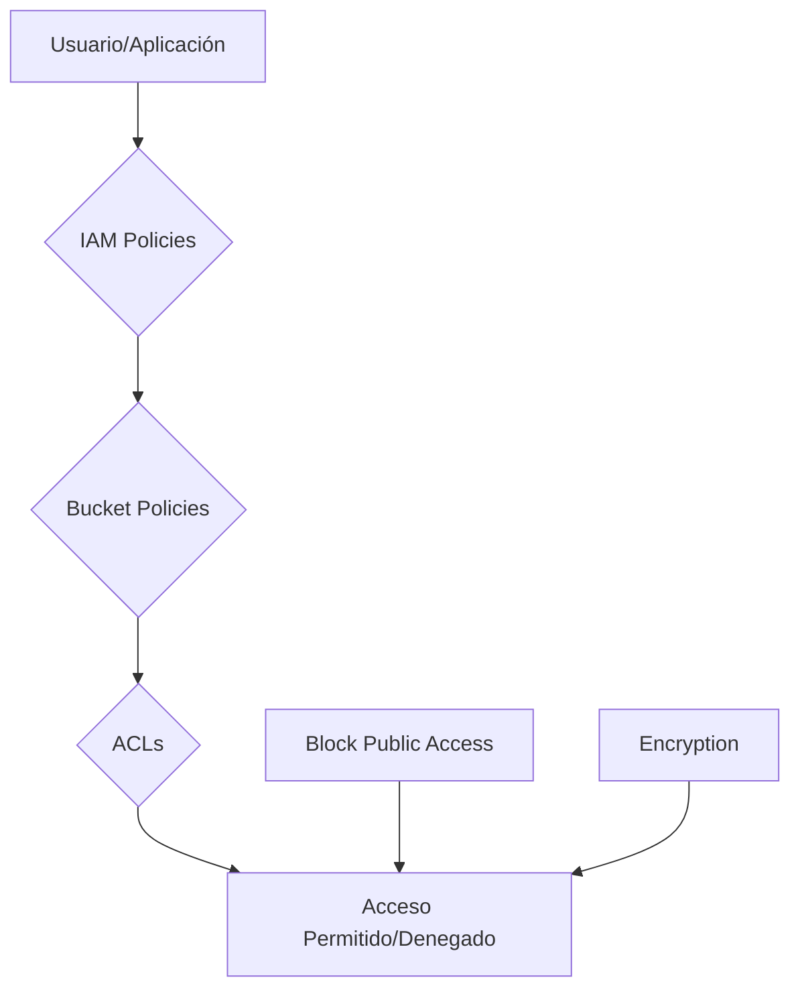
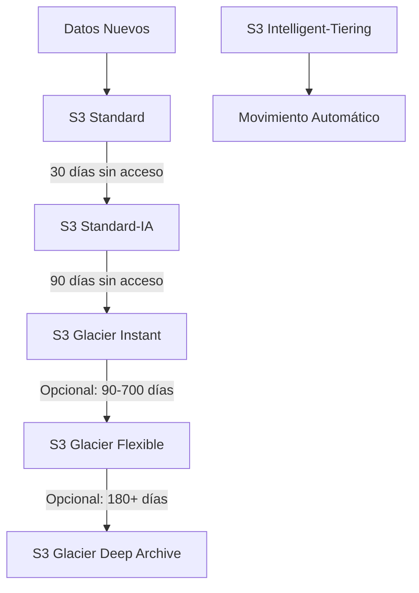
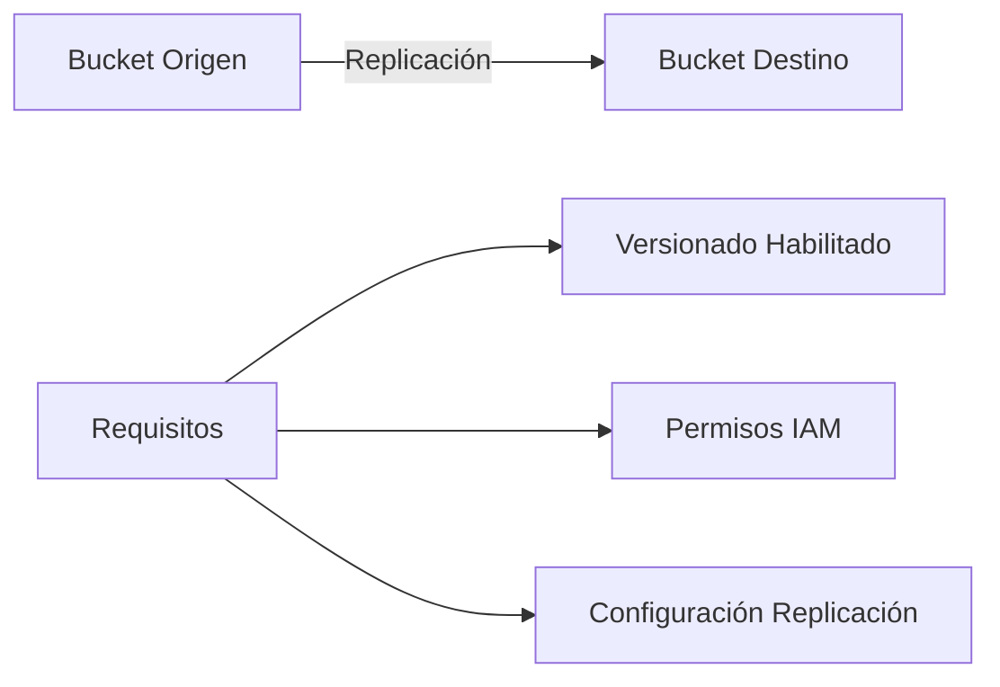
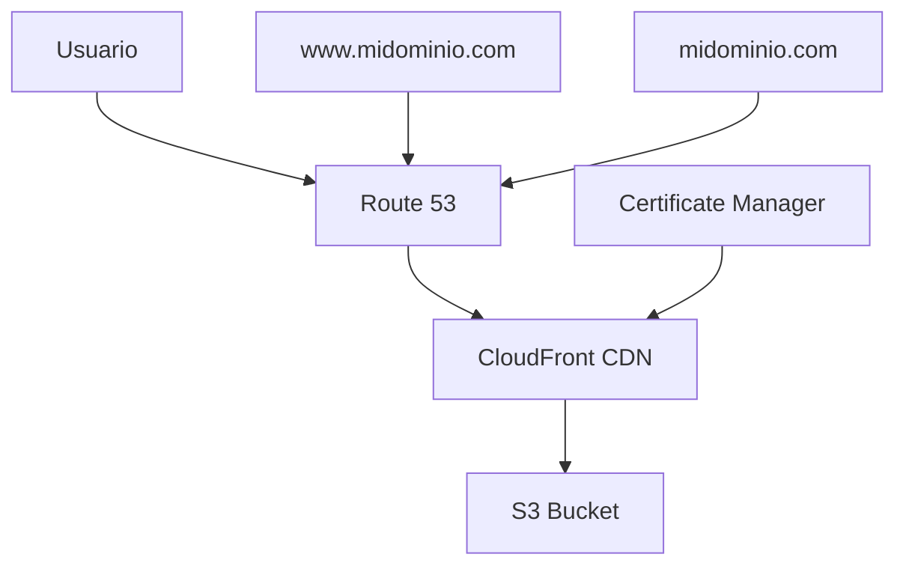

# 🗂️ AWS S3 Fundamentals - Guía Completa para Arquitectos

## 📋 Índice
1. [Introducción a Amazon S3](#introducción-a-amazon-s3)
2. [Conceptos Fundamentales](#conceptos-fundamentales)
3. [Buckets y Objetos](#buckets-y-objetos)
4. [Seguridad en S3](#seguridad-en-s3)
5. [Clases de Almacenamiento](#clases-de-almacenamiento)
6. [Características Avanzadas](#características-avanzadas)
7. [Alojamiento de Sitios Web Estáticos](#alojamiento-de-sitios-web-estáticos)
8. [Proyecto Práctico: Sitio Web Estático con S3 y Route 53](#proyecto-práctico-sitio-web-estático-con-s3-y-route-53)
9. [Mejores Prácticas](#mejores-prácticas)

---

## 🚀 Introducción a Amazon S3

**Amazon Simple Storage Service (S3)** es uno de los servicios fundamentales de AWS y constituye un bloque de construcción esencial para la mayoría de aplicaciones en la nube.

### 🎯 Características Principales
- ✅ **Almacenamiento escalable infinito**
- ✅ **Durabilidad del 99.999999999% (11 nueves)**
- ✅ **Disponibilidad de hasta 99.99%**
- ✅ **Integración nativa con servicios AWS**
- ✅ **Acceso global con replicación regional**

### 📊 Casos de Uso Principales

| Caso de Uso | Descripción | Beneficios |
|-------------|-------------|------------|
| 🔄 **Backup y Archivado** | Copias de seguridad y recuperación de desastres | Durabilidad, costos optimizados |
| 🌐 **Sitios Web Estáticos** | Hosting de aplicaciones web | Escalabilidad, CDN integration |
| 📊 **Data Lakes** | Almacenamiento para Big Data y Analytics | Capacidad ilimitada, integración |
| 📱 **Aplicaciones Móviles** | Backend para apps móviles | APIs RESTful, SDKs |
| 🎬 **Distribución de Medios** | Videos, imágenes, archivos grandes | CDN, streaming |
| 📦 **Distribución de Software** | Actualizaciones y descargas | Escalabilidad global |

---

## 🏗️ Conceptos Fundamentales

### 🪣 Buckets (Contenedores)

Los **buckets** son contenedores que almacenan objetos en S3.

#### Características de los Buckets:
- 📍 **Nombre globalmente único** (en todas las regiones y cuentas AWS)
- 🌍 **Definidos a nivel de región** (aunque S3 parece global)
- 🔒 **Configuración de seguridad independiente**
- 📊 **Métricas y logging configurables**

#### 📝 Convenciones de Nombres de Buckets:

✅ **Permitido:**
- 3-63 caracteres
- Solo letras minúsculas, números y guiones
- Comenzar con letra minúscula o número
- `mi-bucket-ejemplo-2024`

❌ **No Permitido:**
- Mayúsculas: `Mi-Bucket`
- Formato IP: `192.168.1.1`
- Prefijos especiales: `xn--ejemplo`
- Sufijos especiales: `ejemplo-s3alias`

### 📄 Objetos (Archivos)

Los **objetos** son los archivos individuales almacenados en buckets.

#### Estructura de Objetos:

```
🔑 Clave (Key): mi-carpeta/mi-subcarpeta/archivo.jpg
📊 Metadatos: Content-Type, Last-Modified, etc.
🏷️ Etiquetas: Hasta 10 pares clave-valor
🆔 Version ID: Si versionado está habilitado
💾 Datos: El contenido actual del archivo
```

#### Limitaciones:
- 📏 **Tamaño máximo por objeto:** 5 TB
- 📦 **Para archivos > 5 GB:** Usar subida multiparte
- 🗂️ **No hay directorios reales:** Solo prefijos en las claves
- ♾️ **Número de objetos por bucket:** Ilimitado

---

## 🔐 Seguridad en S3

### 🛡️ Modelo de Seguridad Multicapa

Amazon S3 utiliza un modelo de seguridad basado en **múltiples capas** que se evalúan conjuntamente:



### 👤 Políticas Basadas en Usuario (IAM)

**IAM Policies** controlan qué usuarios pueden realizar qué acciones:

```json
{
  "Version": "2012-10-17",
  "Statement": [
    {
      "Effect": "Allow",
      "Action": [
        "s3:GetObject",
        "s3:PutObject"
      ],
      "Resource": "arn:aws:s3:::mi-bucket/*"
    }
  ]
}
```

### 🗂️ Políticas Basadas en Recursos

#### Bucket Policies
Control a nivel de bucket, permite acceso entre cuentas:

```json
{
  "Version": "2012-10-17",
  "Statement": [
    {
      "Sid": "PublicReadGetObject",
      "Effect": "Allow",
      "Principal": "*",
      "Action": "s3:GetObject",
      "Resource": "arn:aws:s3:::mi-sitio-web/*"
    }
  ]
}
```

#### Access Control Lists (ACLs)
- 🗃️ **Object ACLs:** Control fino por objeto
- 🪣 **Bucket ACLs:** Control a nivel de bucket
- ⚠️ **Recomendación:** Usar políticas IAM y de bucket en su lugar

### 🔒 Regla de Evaluación de Acceso

Un usuario puede acceder a un objeto S3 **SI:**
1. ✅ Los permisos IAM LO PERMITEN **O** la política de recurso LO PERMITE
2. ❌ **Y NO** hay una denegación explícita

### 🚫 Block Public Access

Configuración de seguridad adicional para prevenir exposición accidental:

| Configuración | Descripción |
|---------------|-------------|
| `BlockPublicAcls` | Bloquea ACLs públicas nuevas |
| `IgnorePublicAcls` | Ignora ACLs públicas existentes |
| `BlockPublicPolicy` | Bloquea políticas públicas nuevas |
| `RestrictPublicBuckets` | Restringe buckets con políticas públicas |

### 🔐 Cifrado en S3

#### Tipos de Cifrado:

1. **SSE-S3:** Cifrado del lado del servidor con claves gestionadas por S3
2. **SSE-KMS:** Cifrado con AWS Key Management Service
3. **SSE-C:** Cifrado con claves proporcionadas por el cliente
4. **CSE:** Cifrado del lado del cliente

---

## 💾 Clases de Almacenamiento

### 📊 Comparativa Completa de Clases

| Clase | Durabilidad | Disponibilidad | Tiempo de Recuperación | Costo | Caso de Uso |
|-------|-------------|----------------|------------------------|-------|-------------|
| **S3 Standard** | 99.999999999% | 99.99% | Inmediato | $$$ | Acceso frecuente |
| **S3 Standard-IA** | 99.999999999% | 99.9% | Inmediato | $$ | Acceso infrecuente |
| **S3 One Zone-IA** | 99.999999999%* | 99.5% | Inmediato | $ | Backups secundarios |
| **S3 Glacier Instant** | 99.999999999% | 99.9% | Milisegundos | $ | Archivo con acceso inmediato |
| **S3 Glacier Flexible** | 99.999999999% | 99.99% | 1-12 horas | $ | Archivo tradicional |
| **S3 Glacier Deep Archive** | 99.999999999% | 99.99% | 12-48 horas | $ | Archivo a largo plazo |

*En una sola AZ (los datos se pierden si se destruye la AZ)

### 🏗️ Arquitectura de Clases de Almacenamiento



### 🤖 S3 Intelligent-Tiering

**Recomendación:** Ideal cuando no conoces los patrones de acceso.

#### Características:
- 🔄 **Movimiento automático** entre niveles
- 💰 **Pequeña cuota mensual** de monitorización
- 🚫 **Sin cargos de recuperación**
- 📊 **Análisis de patrones de acceso**

#### Niveles Automáticos:
1. **Frequent Access:** Acceso por defecto
2. **Infrequent Access:** Sin acceso por 30 días
3. **Archive Instant:** Sin acceso por 90 días
4. **Archive Access:** Configurable (90-700+ días)
5. **Deep Archive:** Configurable (180-700+ días)

---

## 🔧 Características Avanzadas

### 📚 Versionado de Objetos

El **versionado** permite mantener múltiples versiones del mismo objeto.

#### Características:
- 🔄 **Protección contra eliminación accidental**
- 📊 **Historial completo de cambios**
- 💾 **Cada versión consume almacenamiento**
- 🆔 **Version ID único para cada versión**

#### Estados del Versionado:
- ❌ **Deshabilitado:** Estado por defecto
- ✅ **Habilitado:** Versiones múltiples
- ⏸️ **Suspendido:** No genera nuevas versiones

#### Consideraciones:
- Los archivos existentes antes de habilitar versionado tienen `Version ID = null`
- Suspender versionado **NO elimina** versiones anteriores
- Eliminar un objeto crea un "marcador de eliminación"

### 🔄 Replicación (CRR & SRR)

#### Cross-Region Replication (CRR)
**Replicación entre regiones diferentes**

✅ **Casos de Uso:**
- Cumplimiento regulatorio
- Menor latencia para usuarios globales
- Replicación entre cuentas AWS

#### Same-Region Replication (SRR)
**Replicación dentro de la misma región**

✅ **Casos de Uso:**
- Agregación de logs
- Replicación entre entornos (prod/test)
- Procesamiento de datos en tiempo real

#### Requisitos y Configuración:



#### Limitaciones:
- ⏰ **Solo objetos nuevos** se replican automáticamente
- 🔄 **Sin encadenamiento:** A→B→C no funciona
- 🗑️ **Eliminaciones:** Configurable si replicar marcadores
- 💰 **Costos:** Transferencia de datos entre regiones

---

## 🌐 Alojamiento de Sitios Web Estáticos

### 🏗️ Configuración Básica

Amazon S3 puede alojar sitios web estáticos con una URL pública:

```
http://bucket-name.s3-website-region.amazonaws.com
http://bucket-name.s3-website.region.amazonaws.com
```

### ⚙️ Pasos de Configuración:

1. **Crear bucket** con nombre del dominio
2. **Habilitar hosting** de sitio web estático
3. **Configurar documento índice** (`index.html`)
4. **Configurar página de error** (`error.html`)
5. **Establecer política pública** de lectura
6. **Configurar DNS** (opcional)

### 📝 Política de Bucket para Sitio Web:

```json
{
  "Version": "2012-10-17",
  "Statement": [
    {
      "Sid": "PublicReadGetObject",
      "Effect": "Allow",
      "Principal": "*",
      "Action": "s3:GetObject",
      "Resource": "arn:aws:s3:::mi-sitio-web/*"
    }
  ]
}
```

### ⚠️ Solución de Problemas:

**Error 403 Forbidden:**
- ✅ Verificar política de bucket permite lecturas públicas
- ✅ Verificar Block Public Access está deshabilitado
- ✅ Confirmar que el archivo `index.html` existe

---

## 🚀 Proyecto Práctico: Sitio Web Estático con S3 y Route 53

### 🎯 Objetivo del Proyecto

Crear un sitio web estático profesional utilizando:
- 🗂️ **Amazon S3** para hosting
- 🌍 **Route 53** para gestión DNS
- 🔐 **CloudFront** para CDN (opcional)
- 📜 **Certificate Manager** para HTTPS (opcional)

### 🏗️ Arquitectura del Proyecto



### 📋 Requisitos Previos

- ✅ Cuenta AWS activa
- ✅ Dominio registrado (puede ser en Route 53)
- ✅ Conocimientos básicos de HTML/CSS
- ✅ AWS CLI configurado (opcional)

### 🔧 Fase 1: Preparación del Contenido

#### 1.1 Estructura del Sitio Web

```
mi-sitio-web/
├── index.html          # Página principal
├── error.html          # Página de error
├── about.html          # Página acerca de
├── contact.html        # Página de contacto
├── css/
│   └── styles.css      # Estilos CSS
├── js/
│   └── main.js         # JavaScript
├── images/
│   ├── logo.png
│   └── hero.jpg
└── favicon.ico
```

#### 1.2 Archivo index.html de Ejemplo

```html
<!DOCTYPE html>
<html lang="es">
<head>
    <meta charset="UTF-8">
    <meta name="viewport" content="width=device-width, initial-scale=1.0">
    <title>Mi Empresa - Soluciones en la Nube</title>
    <link rel="stylesheet" href="css/styles.css">
    <link rel="icon" href="favicon.ico" type="image/x-icon">
</head>
<body>
    <header>
        <nav>
            <div class="logo">
                
            </div>
            <ul>
                <li><a href="index.html">Inicio</a></li>
                <li><a href="about.html">Acerca de</a></li>
                <li><a href="contact.html">Contacto</a></li>
            </ul>
        </nav>
    </header>

    <main>
        <section class="hero">
            <h1>Bienvenido a Mi Empresa</h1>
            <p>Soluciones innovadoras en la nube con AWS</p>
            <button class="cta-button">Conoce Más</button>
        </section>

        <section class="services">
            <h2>Nuestros Servicios</h2>
            <div class="service-grid">
                <div class="service-card">
                    <h3>Migración a la Nube</h3>
                    <p>Trasladamos tu infraestructura a AWS de forma segura</p>
                </div>
                <div class="service-card">
                    <h3>Arquitectura Serverless</h3>
                    <p>Desarrollamos aplicaciones escalables sin servidores</p>
                </div>
                <div class="service-card">
                    <h3>DevOps y CI/CD</h3>
                    <p>Automatizamos tus procesos de desarrollo</p>
                </div>
            </div>
        </section>
    </main>

    <footer>
        <p>&copy; 2024 Mi Empresa. Todos los derechos reservados.</p>
    </footer>

    <script src="js/main.js"></script>
</body>
</html>
```

#### 1.3 Archivo error.html

```html
<!DOCTYPE html>
<html lang="es">
<head>
    <meta charset="UTF-8">
    <meta name="viewport" content="width=device-width, initial-scale=1.0">
    <title>Error 404 - Página no encontrada</title>
    <link rel="stylesheet" href="css/styles.css">
</head>
<body>
    <div class="error-container">
        <h1>404</h1>
        <h2>Página no encontrada</h2>
        <p>Lo sentimos, la página que buscas no existe.</p>
        <a href="index.html" class="btn">Volver al inicio</a>
    </div>
</body>
</html>
```

### 🪣 Fase 2: Configuración de S3

#### 2.1 Crear el Bucket S3

```bash
# Con AWS CLI
aws s3 mb s3://mi-empresa-website-2024

# O desde la consola AWS
```

#### 2.2 Configurar Propiedades del Bucket

1. **Habilitar hosting de sitio web estático:**
```bash
aws s3 website s3://mi-empresa-website-2024 \
  --index-document index.html \
  --error-document error.html
```

2. **Configurar política pública:**
```json
{
  "Version": "2012-10-17",
  "Statement": [
    {
      "Sid": "PublicReadGetObject",
      "Effect": "Allow",
      "Principal": "*",
      "Action": "s3:GetObject",
      "Resource": "arn:aws:s3:::mi-empresa-website-2024/*"
    }
  ]
}
```

#### 2.3 Subir Archivos al Bucket

```bash
# Subir todos los archivos
aws s3 sync ./mi-sitio-web/ s3://mi-empresa-website-2024/

# Configurar tipos de contenido
aws s3 cp s3://mi-empresa-website-2024/ s3://mi-empresa-website-2024/ \
  --recursive \
  --metadata-directive REPLACE \
  --content-type "text/html" \
  --exclude "*" \
  --include "*.html"
```

#### 2.4 Desbloquear Acceso Público

```bash
# Eliminar configuraciones de bloqueo público
aws s3api delete-public-access-block \
  --bucket mi-empresa-website-2024
```

### 🌍 Fase 3: Configuración de Route 53

#### 3.1 Crear Zona Hospedada

```bash
# Crear zona hospedada para el dominio
aws route53 create-hosted-zone \
  --name miempresa.com \
  --caller-reference $(date +%s)
```

#### 3.2 Crear Registros DNS

**Registro A para el dominio raíz:**
```json
{
  "Changes": [
    {
      "Action": "CREATE",
      "ResourceRecordSet": {
        "Name": "miempresa.com",
        "Type": "A",
        "AliasTarget": {
          "DNSName": "s3-website-us-east-1.amazonaws.com",
          "EvaluateTargetHealth": false,
          "HostedZoneId": "Z3AQBSTGFYJSTF"
        }
      }
    }
  ]
}
```

**Registro CNAME para www:**
```json
{
  "Changes": [
    {
      "Action": "CREATE",
      "ResourceRecordSet": {
        "Name": "www.miempresa.com",
        "Type": "CNAME",
        "TTL": 300,
        "ResourceRecords": [
          {
            "Value": "miempresa.com"
          }
        ]
      }
    }
  ]
}
```

### 🔒 Fase 4: Seguridad y Optimizaciones

#### 4.1 Configurar CloudFront (Opcional)

```json
{
  "CallerReference": "mi-empresa-cloudfront-2024",
  "Comment": "CDN para mi-empresa.com",
  "DefaultRootObject": "index.html",
  "Origins": {
    "Quantity": 1,
    "Items": [
      {
        "Id": "S3-mi-empresa-website",
        "DomainName": "mi-empresa-website-2024.s3-website-us-east-1.amazonaws.com",
        "CustomOriginConfig": {
          "HTTPPort": 80,
          "HTTPSPort": 443,
          "OriginProtocolPolicy": "http-only"
        }
      }
    ]
  },
  "DefaultCacheBehavior": {
    "TargetOriginId": "S3-mi-empresa-website",
    "ViewerProtocolPolicy": "redirect-to-https",
    "MinTTL": 0,
    "DefaultTTL": 86400,
    "MaxTTL": 31536000
  }
}
```

#### 4.2 Certificado SSL con ACM

```bash
# Solicitar certificado SSL
aws acm request-certificate \
  --domain-name miempresa.com \
  --subject-alternative-names www.miempresa.com \
  --validation-method DNS \
  --region us-east-1
```

### 📊 Fase 5: Monitoreo y Métricas

#### 5.1 Configurar CloudWatch

```bash
# Habilitar métricas de S3
aws s3api put-bucket-metrics-configuration \
  --bucket mi-empresa-website-2024 \
  --id EntireBucket \
  --metrics-configuration Id=EntireBucket
```

#### 5.2 Configurar Logging

```json
{
  "LoggingEnabled": {
    "TargetBucket": "mi-empresa-logs-2024",
    "TargetPrefix": "access-logs/"
  }
}
```

### 🧪 Fase 6: Pruebas y Validación

#### 6.1 Lista de Verificación

- [ ] ✅ El sitio carga correctamente en `http://mi-empresa-website-2024.s3-website-us-east-1.amazonaws.com`
- [ ] ✅ Los archivos CSS y JavaScript se cargan
- [ ] ✅ Las imágenes se muestran correctamente
- [ ] ✅ La página de error 404 funciona
- [ ] ✅ El dominio personalizado resuelve correctamente
- [ ] ✅ Redirección de www funciona
- [ ] ✅ HTTPS está habilitado (si se configuró CloudFront)

#### 6.2 Comandos de Prueba

```bash
# Verificar resolución DNS
nslookup miempresa.com

# Probar conectividad
curl -I http://miempresa.com

# Verificar headers de seguridad
curl -I https://miempresa.com
```

### 💰 Fase 7: Optimización de Costos

#### 7.1 Configurar Lifecycle Policies

```json
{
  "Rules": [
    {
      "ID": "TransitionToIA",
      "Status": "Enabled",
      "Filter": {
        "Prefix": "logs/"
      },
      "Transitions": [
        {
          "Days": 30,
          "StorageClass": "STANDARD_IA"
        },
        {
          "Days": 90,
          "StorageClass": "GLACIER"
        }
      ]
    }
  ]
}
```

#### 7.2 Monitoreo de Costos

```bash
# Ver costos estimados
aws ce get-cost-and-usage \
  --time-period Start=2024-01-01,End=2024-01-31 \
  --granularity MONTHLY \
  --metrics BlendedCost \
  --group-by Type=DIMENSION,Key=SERVICE
```

### 🔄 Fase 8: Automatización y CI/CD

#### 8.1 Script de Despliegue

```bash
#!/bin/bash
# deploy.sh

BUCKET_NAME="mi-empresa-website-2024"
DISTRIBUTION_ID="E1234567890ABC"

echo "🚀 Iniciando despliegue..."

# Sincronizar archivos
aws s3 sync ./dist/ s3://$BUCKET_NAME/ --delete

# Invalidar caché de CloudFront
aws cloudfront create-invalidation \
  --distribution-id $DISTRIBUTION_ID \
  --paths "/*"

echo "✅ Despliegue completado"
```

#### 8.2 GitHub Actions

```yaml
name: Deploy to S3
on:
  push:
    branches: [ main ]

jobs:
  deploy:
    runs-on: ubuntu-latest
    steps:
    - uses: actions/checkout@v2
    
    - name: Configure AWS credentials
      uses: aws-actions/configure-aws-credentials@v1
      with:
        aws-access-key-id: ${{ secrets.AWS_ACCESS_KEY_ID }}
        aws-secret-access-key: ${{ secrets.AWS_SECRET_ACCESS_KEY }}
        aws-region: us-east-1
    
    - name: Deploy to S3
      run: |
        aws s3 sync ./ s3://mi-empresa-website-2024/ --delete
        aws cloudfront create-invalidation --distribution-id ${{ secrets.CLOUDFRONT_DISTRIBUTION_ID }} --paths "/*"
```

---

## ✅ Mejores Prácticas

### 🔐 Seguridad

1. **Principio de Menor Privilegio**
   - Concede solo los permisos mínimos necesarios
   - Usa roles IAM en lugar de credenciales hardcodeadas

2. **Cifrado**
   - Habilita cifrado por defecto en todos los buckets
   - Usa KMS para datos sensibles

3. **Monitoreo**
   - Habilita CloudTrail para auditoría
   - Configura alertas para accesos inusuales

### 💰 Optimización de Costos

1. **Lifecycle Policies**
   - Migra automáticamente a clases más baratas
   - Elimina versiones antiguas automáticamente

2. **Intelligent Tiering**
   - Usa para datos con patrones de acceso desconocidos
   - Monitorea los costos de transición

3. **Análisis de Costos**
   - Usa Storage Class Analysis
   - Revisa métricas de utilización regularmente

### ⚡ Rendimiento

1. **Estructura de Claves**
   - Evita hot spots en el particionado
   - Usa prefijos aleatorios para alta concurrencia

2. **CloudFront**
   - Implementa CDN para contenido estático
   - Configura cacheo apropiado

3. **Transfer Acceleration**
   - Usa para uploads grandes desde ubicaciones remotas

### 🔄 Operaciones

1. **Versionado**
   - Habilita versionado para datos críticos
   - Configura MFA Delete para protección adicional

2. **Replicación**
   - Configura CRR para cumplimiento regulatorio
   - Usa SRR para alta disponibilidad

3. **Backup**
   - Implementa estrategias de backup automático
   - Prueba procedimientos de recuperación regularmente

### 📊 Monitoreo y Alertas

1. **Métricas Clave**
   - Número de requests
   - Transferencia de datos
   - Errores de acceso

2. **Alertas**
   - Acceso público no autorizado
   - Costos inusualmente altos
   - Fallos de replicación

---

## 🎯 Resumen Ejecutivo

Amazon S3 es un servicio fundamental que proporciona almacenamiento escalable, duradero y altamente disponible. Su integración con otros servicios AWS como Route 53, CloudFront y Certificate Manager permite crear soluciones completas para hosting web, backup, análisis de datos y distribución de contenido.

### 🔑 Puntos Clave:
- ✅ **Escalabilidad infinita** con costos optimizados
- ✅ **11 nueves de durabilidad** para máxima confiabilidad
- ✅ **Múltiples clases de almacenamiento** para diferentes casos de uso
- ✅ **Integración nativa** con el ecosistema AWS
- ✅ **Modelo de seguridad robusto** con múltiples capas

### 🚀 Próximos Pasos:
1. Implementar el proyecto práctico propuesto
2. Explorar características avanzadas como S3 Transfer Family
3. Integrar con servicios de análisis como Athena y QuickSight
4. Automatizar operaciones con Lambda y EventBridge

---

*Documento creado por: [Roberto Ayra] | Fecha: [Junio 2024] | Versión: 1.0*
